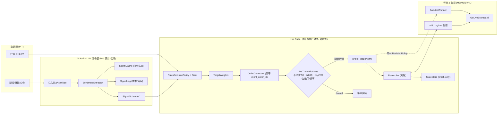
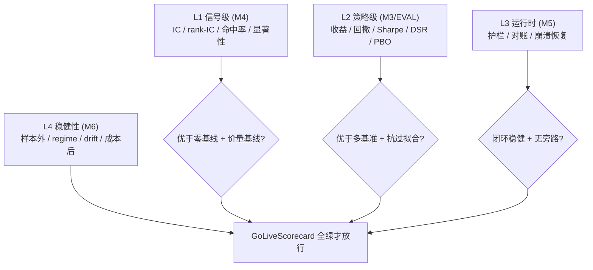
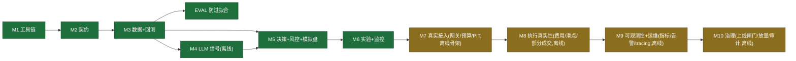

# Agentic Trading

> 混合架构的 Agentic 交易研究系统：**LLM 提取结构化信号 · 规则/量化层负责决策与执行**。在严格的回测与模拟盘验证下追求可持续、可复现的盈利。

<!-- Stack & quality badges -->


[](https://github.com/AndyUneducated/agentic-trading/actions/workflows/ci.yml)
-orange)


> ⚠️ **免责声明**：本项目仅用于个人研究，**不构成任何投资建议**。默认一切走模拟盘（`TRADING_MODE=paper`）；未经明确人类批准，绝不接入真实资金。加密货币与股票交易存在本金损失风险。

---

## 目录

- [1. 这是什么](#1-这是什么)
- [2. 功能特性一览](#2-功能特性一览)
- [3. 两层代理心智模型](#3-两层代理心智模型)
- [4. 系统架构](#4-系统架构)
- [5. 一次决策的完整逻辑（分步拆解）](#5-一次决策的完整逻辑分步拆解)
- [6. 运行时闭环（数据流）](#6-运行时闭环数据流)
- [7. 分层评测体系](#7-分层评测体系)
- [8. 代码模块地图](#8-代码模块地图)
- [9. 里程碑状态](#9-里程碑状态)
- [10. 安全护栏](#10-安全护栏)
- [11. 技术栈](#11-技术栈)
- [12. 快速开始](#12-快速开始)
- [13. 深度使用范例](#13-深度使用范例)
- [14. 仓库结构](#14-仓库结构)
- [15. 文档导航](#15-文档导航)

---

## 1. 这是什么

| 维度 | 说明 |
| --- | --- |
| **一句话** | LLM 从非结构化信息（新闻/财报/公告/情绪）提取结构化信号；确定性规则/量化层负责下单。LLM **绝不**直接产生交易动作。 |
| **标的** | 美股、ETF、加密货币（先聚焦少量高流动性标的）。 |
| **资金路径** | 回测 → 模拟盘验证 → 达标后小额实盘 → 逐步放量。 |
| **架构红线** | 运行时 LLM 只输出信号；决策与执行只在确定性层（见 [ADR-0001](docs/decisions/0001-llm-positioning-hybrid.md)）。 |
| **当前状态** | M1–M10 **离线内核已全部落地并全绿**（192 测试）；**离线优先**：真实 LLM / 数据 / 券商 / Nautilus / 合规签署等真实基建收敛到"人类开关"后（见 [ADR-0009](docs/decisions/0009-offline-first-productionization.md)）。 |
| **核心理念** | 评测即测试（无评测不合并）、规格先行、单变量实验、防过拟合为一等公民、回测-实盘一致。 |

**与"让 LLM 自主交易"的关键区别**：业界 2026 的共识是 LLM 太慢（ms–s 级），须"hot path（确定性执行）/ AI path（LLM 异步生成信号）"解耦——我们的混合红线正是这一范式。

### 设计原则（为什么这样设计）

| 原则 | 怎么做 | 防的什么 |
| --- | --- | --- |
| **契约先行** | `core/` 先定 Pydantic 类型 + Protocol，实现藏在接口后 | 模块耦合、难以替换/mock |
| **评测即测试** | 无评测不合并；信号级 + 策略级双层裁判 | "代码全绿≠会赚钱" |
| **确定性优先** | 决策/回测为纯函数；不确定性（LLM）隔离在 `signals/` 且缓存+留痕 | 不可复现、难以归因 |
| **回测-实盘同源** | 回测与实盘调用同一 `DecisionPolicy` | 代码分叉导致的 drift |
| **PIT 纪律** | 所有时间字段 `AwareDatetime`，`as_of` 过滤 | look-ahead / 幸存者偏差 |
| **防过拟合一等公民** | walk-forward + purged CV + holdout + DSR/PBO + n_trials | 过拟合（头号敌人） |
| **安全默认** | 默认 paper、kill switch、异常即安全降级 | 不可逆的实盘亏损 |
| **离线优先** | stub LLM/broker/data，全链路零联网可复现 | 算力/成本/网络依赖 |

---

## 2. 功能特性一览

按能力域组织的功能清单（🟢 已落地/离线可跑，🟡 离线内核+真实基建待接）。所有功能**开箱即跑、零联网**。

| 能力域 | 功能点 | 关键实现 | 状态 |
| --- | --- | --- | --- |
| **数据 (PIT)** | Point-in-Time 行情存储、`as_of` 过滤、增量 upsert、数据质量校验 | `PITStore` · `InMemoryDataSource` · `check_bars` | 🟢 |
| **LLM 信号** | 离线确定性抽取、注入防护、指纹缓存、成本/留痕、prompt 版本化 | `SentimentExtractor` · `KeywordLLMClient` · `SignalCache` · `SignalLog` | 🟢 |
| **AI 网关 (M7)** | 多后端重试/降级、响应缓存、成本预算熔断、优先级节流、PIT 新闻源、真实后端适配 | `AIGateway` · `CostBudget` · `PriorityThrottler` · `InMemoryNewsSource` · `OpenAICompatibleClient` | 🟡 |
| **决策** | 情绪阈值选股、等权原始意图、单标的/敞口约束、波动率目标仓位 | `RulesDecisionPolicy` · `PassthroughSizer` · `VolatilityTargetSizer` | 🟢 |
| **风控** | kill switch、交易模式、日亏熔断、单笔/单标的/总敞口/频率闸门（无旁路） | `PreTradeRiskGate` · `RiskLimits` | 🟢 |
| **执行** | 幂等差额下单、模拟即时成交、对账、崩溃恢复、高保真成交（延迟/部分成交/费用/滑点） | `TradingLoop` · `SimulatedBroker` · `RealisticBroker` · `Reconciler` · `FileStateStore` | 🟢 / 🟡 |
| **回测** | 确定性逐期重放、成本模型、回测-实盘同源、基线策略 | `BacktestRunner` · `CostModel` · 4× 基线策略 | 🟢 |
| **信号评测** | IC / rank-IC / 命中率 / t 统计、保守偏差检查 | `evaluate_signal` · `check_conservatism` | 🟢 |
| **防过拟合** | walk-forward、purged/embargo CV、留出集守卫、DSR、PBO | `walk_forward` · `purged_kfold` · `HoldoutGuard` · `deflated_sharpe_ratio` · `pbo` | 🟢 |
| **实验** | 单变量强制、自动记账、基线对照、实验日志落盘 | `ExperimentSpec` · `run_experiment` · `ExperimentRegistry` | 🟢 |
| **监控 (M9)** | 零依赖 Prometheus 指标、阈值告警、轻量 tracing、regime/drift 检测 | `MetricsRegistry` · `AlertRule` · `Tracer` · `RegimeMonitor` · `compute_drift` | 🟢 |
| **治理 (M10)** | 上线闸门三重红线、放量/回滚状态机、哈希链防篡改审计 | `GoLiveGate` · `CapitalRampController` · `AuditTrail` | 🟢 |
| **上线记分卡** | 四层 eval 收口为单一 go/no-go | `GoLiveScorecard` · `build_edge_criteria` | 🟢 |

---

## 3. 两层代理心智模型

本项目最重要的概念：存在**两类**"代理"，切勿混淆。

| | 🛠️ 构建期代理（Build-time） | 🤖 运行时代理（Runtime） |
| --- | --- | --- |
| **是谁** | 在 Cursor 写代码的 AI 编码代理 | 系统里做信号提取的 LLM |
| **产物** | 代码 / 文档 / 规格 / 评测 | 结构化信号/因子（**不下单**） |
| **治理** | 代码审查 · 测试 · 评测门槛 | Prompt 版本化 · 决策留痕 · 信号评测 · 运行时护栏 |
| **风险** | 引入 bug / 过拟合 | 幻觉 / 保守偏差 / prompt 注入 / 成本失控 |

---

## 4. 系统架构



**要点**：

- 🔴 **LLM 在 AI Path，永不进入下单链路**；Hot Path 全确定性、可回测。
- 🔒 **所有订单必过 `PreTradeRiskGate`，无旁路**（有断言测试）。
- ♻️ **回测与实盘调用同一个 `DecisionPolicy`**（[ADR-0003](docs/decisions/0003-backtest-live-parity.md)），drift 只应来自真实摩擦。

---

## 5. 一次决策的完整逻辑（分步拆解）

从"一条新闻"到"一笔（可能的）订单"，系统内部经历以下确定性步骤。**除第 ①/② 步的信号抽取外，其余全部是纯函数、可回测、可手算校验**。

| # | 步骤 | 输入 → 输出 | 关键逻辑 / 公式 | 代码 |
| --- | --- | --- | --- | --- |
| ① | **PIT 取数** | `as_of` → 只含 `published_at ≤ as_of` 的文档 + `ts ≤ as_of` 的行情 | 时间是过滤主键，杜绝 look-ahead | `news.documents_as_of` · `PITStore.read_bars` |
| ② | **信号抽取** | 文档 → `SignalSchemaV1{sentiment∈[-1,1], confidence, event_flag, horizon}` | 外部文本视为不可信 → sanitize 隔离；LLM 只产结构化信号 | `SentimentExtractor.extract` |
| ③ | **选股** | 信号 → 入选标的集 | 取每标的**最新** `as_of` 信号；`sentiment > 阈值 且 confidence ≥ 下限` 才入选，否则空仓（安全默认） | `RulesDecisionPolicy.decide` |
| ④ | **原始权重** | 入选集 → 等权意图 | `w_raw = 1 / n_selected` | `RulesDecisionPolicy` |
| ⑤ | **仓位管理** | 原始权重 → 受约束权重 | 禁空(可配)、单标的上限、总敞口上限；波动率目标：`scale = target_vol / √(Σ wᵢ²σᵢ²)` | `PassthroughSizer` · `VolatilityTargetSizer` |
| ⑥ | **目标→订单** | 目标权重 + 持仓 → 差额订单 | `desired = w·equity/price`；`Δ = desired − held`；跳过 `|Δ|·price < min_notional` 的碎单；`client_order_id = hash(as_of,symbol,side,qty)`（幂等） | `weights_to_orders` |
| ⑦ | **预交易风控** | 订单 → approved / denied | 全局闸门（kill/模式/日亏）→ 逐单闸门（单笔名义/单标的/总敞口/频率）；**带符号名义**累加，降风险单正确放行 | `PreTradeRiskGate.check` |
| ⑧ | **执行** | approved → 成交回报 | 幂等去重（重放/重启不重复下单）；模拟即时成交或高保真（延迟/部分成交/费用/滑点） | `SimulatedBroker` / `RealisticBroker` |
| ⑨ | **对账 + 持久化** | broker 状态 vs 内部状态 → 一致性 + 落盘 | 先记录本步提交再对账（避免自单误判）；原子写状态支持崩溃恢复 | `Reconciler` · `FileStateStore` |
| ⚠️ | **安全降级** | 任一步异常 → 本步不交易 | 默认不动作而非盲目下单；记 `degraded` 指标 | `TradingLoop.step` |

**日亏熔断的"按日"语义**：`day_start_equity` 跨自然日重置；当 `portfolio.equity ≤ day_start_equity·(1 − daily_loss_limit)` 时当日全拒。

**回测-实盘同源**：③–⑥ 完全相同的 `DecisionPolicy` 既被 `BacktestRunner` 逐期调用，也被 `TradingLoop` 实时调用（[ADR-0003](docs/decisions/0003-backtest-live-parity.md)）——差异只应来自真实摩擦，不来自代码分叉。

---

## 6. 运行时闭环（数据流）

```mermaid
sequenceDiagram
    autonumber
    participant Loop as TradingLoop
    participant Data as DataSource (PIT)
    participant Sig as SignalSource (LLM)
    participant Pol as DecisionPolicy
    participant Risk as PreTradeRiskGate
    participant Brk as Broker
    participant Rec as Reconciler
    participant St as StateStore

    Loop->>Data: 拉取 ≤now 的行情 (无未来)
    Loop->>Sig: signals_as_of(now)
    Loop->>Pol: decide(ctx=行情+信号+持仓)
    Pol-->>Loop: TargetWeights
    Loop->>Loop: weights_to_orders (差额, 幂等 id)
    Loop->>Risk: check(orders, portfolio)
    Risk-->>Loop: approved / denied(附原因)
    Loop->>Brk: submit(approved) 幂等去重
    Loop->>Rec: reconcile(broker, state)
    Loop->>St: 原子持久化 (可崩溃恢复)
    Note over Loop: 任一步异常 → 安全降级(本步不交易)
```

---

## 7. 分层评测体系

评测是本项目的"测试套件"，随里程碑逐层长出，最终汇聚成上线记分卡。



| 层 | 关键机制 | 防的什么 |
| --- | --- | --- |
| 信号级 | `evaluate_signal`（IC/t 统计）、`check_conservatism` | 信号无预测力 / LLM 保守偏差 |
| 策略级 | `walk_forward` · `purged_kfold` · `HoldoutGuard` · `deflated_sharpe_ratio` · `pbo` | 过拟合 / 偷看留出集 / 多重检验 |
| 基线 | `run_baselines`（zero/price_only/buy_hold）· `oss_baseline_from_equity` | 只跑赢玩具 / 已被定价 |
| 运行时 | 风控注入测试 · 对账 · 崩溃恢复 · 回测-实盘 parity | 订单绕过风控 / 状态漂移 / 代码分叉 |
| 稳健性 | `RegimeMonitor` · `compute_drift` · `ExperimentRegistry`(n_trials) | 市场 regime 衰减 / 实盘偏离 |

---

## 8. 代码模块地图

| 包 | 职责 | 关键类型 |
| --- | --- | --- |
| `core/` | 领域契约（contracts-first） | `Bar` `Signal` `Order` `Fill` `PortfolioState` · `DecisionPolicy` `Broker` `RiskGate` 等 Protocol · `SignalSchemaV1` `EdgeCriteria` `RunManifest` |
| `config/` | 类型化配置与安全护栏 | `Settings`（`trading_mode`/`kill_switch`/`can_trade`） |
| `data/` | PIT 数据层 | `PITStore`(parquet, `as_of` 过滤) · `InMemoryDataSource` · `check_bars` |
| `backtest/` | 确定性参考回测引擎 | `BacktestRunner` · `CostModel` · 基线策略 |
| `signals/` | LLM 信号层（离线优先）+ M7 真实接入骨架 | `LLMClient`+`KeywordLLMClient` · `SentimentExtractor` · `SignalCache`/`SignalLog` · `LLMSignalSource` · **`AIGateway`**(重试/降级/缓存/预算熔断) · **`CostBudget`** · **`PriorityThrottler`** · **`InMemoryNewsSource`**(PIT) · **`OpenAICompatibleClient`** |
| `decision/` | 规则/量化决策层 | `RulesDecisionPolicy` · `PassthroughSizer` · `VolatilityTargetSizer` |
| `risk/` | 预交易风控门 | `PreTradeRiskGate` · `RiskLimits` |
| `execution/` | 执行闭环 + M8 执行真实性 | `TradingLoop` · `weights_to_orders` · `SimulatedBroker` · `Reconciler` · `FileStateStore` · **`RealisticBroker`**(延迟/部分成交) · **`CommissionModel`**/**`SlippageModel`** |
| `eval/` | 分层评测 + 防过拟合 | `metrics` · `validation` · `overfit` · `baselines` · `scorecard`(`GoLiveScorecard`) · `report` · `signal_eval` |
| `experiments/` | 单变量实验 + 记账 | `ExperimentSpec`(单变量强制) · `run_experiment` · `ExperimentRegistry`(n_trials) |
| `monitoring/` | regime/drift + M9 可观测性 | `RegimeMonitor` · `compute_drift` · `MetricsRegistry` · **`AlertRule`/`evaluate_alerts`** · **`Tracer`** |
| `governance/` | M10 上线治理 | **`GoLiveGate`**(三重红线) · **`CapitalRampController`**(放量/回滚) · **`AuditTrail`**(哈希链审计) |

### 可观测性度量（M9，离线核心）

零依赖 `MetricsRegistry` 按 **Prometheus 文本 exposition** 导出，可被真实 Prometheus 直接 scrape；埋点默认可选（`metrics=None` 时零开销、不改行为）。

| 指标 | 类型 | 来源 |
| --- | --- | --- |
| `atrading_decision_seconds` | Histogram | 每决策周期耗时 |
| `atrading_steps_total{result}` | Counter | 循环步数（ok/degraded） |
| `atrading_orders_submitted_total` | Counter | 提交订单数 |
| `atrading_risk_denials_total{reason}` | Counter | 风控拒单（按原因） |
| `atrading_reconcile_mismatch` | Gauge | 对账不一致数 |
| `atrading_llm_cost_usd_total{model}` · `atrading_llm_tokens_total{kind}` | Counter | LLM 成本 / token |
| `atrading_signal_cache_total{result}` · `atrading_suspicious_docs_total` | Counter | 缓存命中 / 注入嫌疑 |

```python
from atrading.monitoring import MetricsRegistry, build_metrics_server

metrics = MetricsRegistry()                       # 传给 TradingLoop / SentimentExtractor
server = build_metrics_server(metrics, port=9108)  # 暴露 GET /metrics
server.serve_forever()
```

---

## 9. 里程碑状态



| 里程碑 | 目标 | 状态 |
| --- | --- | --- |
| M1 工具链 | uv/ruff/mypy/CI + `Settings` + `RunManifest` | ✅ 完成 |
| M2 领域契约 | types/interfaces/schema/config/falsification | ✅ 完成 |
| M3 数据 + 回测 | `PITStore` + `BacktestRunner` + 指标 | ✅ 完成 |
| EVAL 防过拟合 | validation/overfit/baselines/scorecard/report（[ADR-0005](docs/decisions/0005-evaluation-and-anti-overfitting.md)） | ✅ 完成 |
| M4 LLM 信号层 | 离线 stub 全链路 + 信号评测 | ✅ 完成（离线优先） |
| M5 决策 + 模拟盘 | 决策层 + 风控门 + 对账 + 崩溃恢复（[ADR-0006](docs/decisions/0006-runtime-execution-and-safety.md)） | ✅ 完成（模拟） |
| M6 实验 + 监控 | 单变量实验 + regime/drift（[ADR-0007](docs/decisions/0007-experimentation-and-monitoring.md)） | ✅ 完成（离线） |
| **M7 真实接入 MVP** | AI gateway / 成本预算熔断 / 优先级节流 / PIT 新闻源 / 真实后端适配 | 🟡 离线骨架已落地（真实联网待人类开关） |
| **M8 生产执行引擎** | 高保真 broker（费用/滑点/延迟/部分成交）+ 回测-实盘 parity | 🟡 离线执行真实性已落地（Nautilus/真实 paper 待接） |
| **M9 可观测性 + 运维** | 指标 + 告警规则 + tracing + 容器化 + runbook | 🟡 离线核心已落地（Grafana/OTLP/密钥托管待接） |
| **M10 合规 + 小额实盘** | 上线闸门（三重红线）+ 放量/回滚状态机 + 防篡改审计 | 🟡 治理内核已落地（合规对接/实盘签署待人类闸门） |

> 生产化路线（M7–M10）依据 → [docs/PRODUCTION-READINESS.md](docs/PRODUCTION-READINESS.md)；离线优先落地取舍 → [ADR-0009](docs/decisions/0009-offline-first-productionization.md)。

---

## 10. 安全护栏

| 护栏 | 机制 | 位置 |
| --- | --- | --- |
| **LLM 不下单** | 架构红线；LLM 仅在 AI Path 产信号 | 全局（ADR-0001） |
| **默认模拟盘** | `TRADING_MODE=paper`；`live` 须 `live_confirmed=true` | `config/settings.py` |
| **Kill switch** | `KILL_SWITCH=true` → 全部订单拒绝 | `PreTradeRiskGate` |
| **预交易风控** | 单笔名义 / 单标的 / 总敞口 / 下单频率 / 日亏熔断 | `risk/gate.py`（无旁路测试覆盖） |
| **幂等下单** | 确定性 `client_order_id` → 重启/重放不重复 | `execution/order_gen.py` |
| **崩溃恢复** | 原子写状态 + 启动对账 | `execution/state_store.py` |
| **安全降级** | 异常/超时默认不交易，而非盲目下单 | `execution/loop.py` |
| **prompt 注入防护** | 外部文本隔离 + 可疑模式标记 | `signals/sanitize.py` |
| **密钥不入库** | 只用 `.env`（见 `.env.example`）+ CI gitleaks 扫描 | `.github/workflows/ci.yml` |

---

## 11. 技术栈

| 类别 | 选型 | 备注 |
| --- | --- | --- |
| 语言 | Python 3.11+（本地 3.12） | 见 `.python-version` |
| 依赖管理 | **uv** | `uv sync --dev` |
| 数据模型 | **Pydantic v2** + pydantic-settings | 类型化契约与配置 |
| 数据处理 | pandas · pyarrow(parquet) | PIT 存储 |
| 日志 | structlog | 结构化留痕 |
| Lint/格式 | **Ruff** | `E,F,I,UP,B,SIM` |
| 类型检查 | **mypy --strict** | + pydantic 插件 |
| 测试 | pytest | golden / slow 标记 |
| CI | GitHub Actions | quality · eval-smoke · gitleaks |

---

## 12. 快速开始

```bash
# 1. 安装 uv（若未安装）: https://docs.astral.sh/uv/
# 2. 同步依赖（含 dev）
uv sync --dev

# 3. 运行全部质量门禁（全离线，无需任何 API key）
uv run ruff check src tests
uv run ruff format --check src tests
uv run mypy
uv run pytest            # 192 passed

# 仅跑 golden 已知答案回归
uv run pytest -m golden

# 配置（可选）：复制环境样例；默认 paper 模式，无需密钥即可跑测试
cp .env.example .env
```

> 本仓库**开箱即跑、零联网、零 LLM 调用**：`KeywordLLMClient` / `SimulatedBroker` / `InMemoryDataSource` 让整条信号→决策→执行→评测链路可离线复现。

### 端到端最小示例（离线回测）

```python
from datetime import UTC, datetime
from atrading.backtest import BacktestRunner, ConstantWeightPolicy, CostModel
from atrading.core.strategy_config import StrategyConfig
from atrading.core.types import Bar
from atrading.data import InMemoryDataSource

bars = [Bar(symbol="A", ts=datetime(2026, 1, d, tzinfo=UTC),
            open=p, high=p, low=p, close=p, volume=1.0)
        for d, p in [(1, 100.0), (2, 110.0), (3, 121.0)]]

runner = BacktestRunner(
    policy=ConstantWeightPolicy({"A": 1.0}),
    data=InMemoryDataSource(bars),
    costs=CostModel(commission_bps=1.0, slippage_bps=5.0),
    config=StrategyConfig(name="demo", universe=["A"], decision_freq="daily"),
    initial_cash=100_000.0,
)
result = runner.run(datetime(2026, 1, 1, tzinfo=UTC), datetime(2026, 1, 3, tzinfo=UTC))
print(result.equity_values())   # 可复现的权益曲线
```

> **可运行示例即测试**：`tests/golden/`（手算已知答案回归）、`tests/unit/test_trading_loop.py`（完整模拟盘闭环）、`tests/unit/test_signal_source.py`（LLM 信号→回测）都是可直接阅读的端到端用例。

---

## 13. 深度使用范例

以下 6 个片段覆盖核心工作流，全部**离线可跑、零 API key**。每个片段都有对应单测作为可运行证据（见文末引用）。

### 13.1 LLM 信号抽取（网关 + 预算熔断 + 缓存）

真实后端只需把 `KeywordLLMClient` 换成 `OpenAICompatibleClient`，其余不变。

```python
from datetime import UTC, datetime
from atrading.signals import (
    AIGateway, CostBudget, Document, InMemoryNewsSource,
    KeywordLLMClient, SentimentExtractor, SignalCache, load_prompt,
)

budget = CostBudget(daily_limit_usd=5.0)                       # 预算耗尽即熔断，安全降级
gateway = AIGateway(KeywordLLMClient(), budget=budget)         # 多后端重试/降级/响应缓存
extractor = SentimentExtractor(
    gateway,
    load_prompt("sentiment", "v1", expected_schema="SignalDraft"),
    cache=SignalCache(),                                        # 指纹去重：同输入不重复调用
)

news = InMemoryNewsSource([
    Document(source_id="wire", symbol="AAPL",
             published_at=datetime(2026, 1, 2, tzinfo=UTC),
             text="Apple beats earnings, raises guidance; record revenue."),
])
as_of = datetime(2026, 1, 3, tzinfo=UTC)
docs = news.documents_as_of(as_of, ["AAPL"])                   # PIT：只见已发布文档
result = extractor.extract(symbol="AAPL", as_of=as_of, documents=docs)
print(result.signal.sentiment, result.signal.confidence, result.cost_usd)
```

### 13.2 完整模拟盘闭环（信号 → 决策 → 风控 → 执行 → 对账）

```python
from datetime import UTC, datetime, timedelta
from atrading.config.settings import Settings
from atrading.core.signal_schema import SignalSchemaV1
from atrading.core.strategy_config import StrategyConfig
from atrading.core.types import Bar
from atrading.data import InMemoryDataSource
from atrading.decision import PassthroughSizer, RulesDecisionPolicy
from atrading.execution import FileStateStore, SimulatedBroker, TradingLoop
from atrading.risk import PreTradeRiskGate, RiskLimits
from atrading.signals import LLMSignalSource

config = StrategyConfig(name="demo", universe=["AAA"], decision_freq="daily")
prices: dict[str, float] = {}                                  # 由 loop 持续更新（broker/风控共享引用）
days = [datetime(2026, 1, 1, tzinfo=UTC) + timedelta(days=i) for i in range(3)]
bars = [Bar(symbol="AAA", ts=d, open=p, high=p, low=p, close=p, volume=1.0)
        for d, p in zip(days, [100.0, 101.0, 102.0])]
signal = SignalSchemaV1(symbol="AAA", as_of=days[0], sentiment=0.8, horizon_days=5,
                        confidence=0.9, model_version="offline-keyword-v1",
                        prompt_version="v1", rationale="demo")

loop = TradingLoop(
    policy=RulesDecisionPolicy(config, PassthroughSizer(config)),
    data=InMemoryDataSource(bars),
    signals=LLMSignalSource([signal]),
    risk_gate=PreTradeRiskGate(
        RiskLimits(max_position_per_name=60_000, max_gross_exposure=100_000,
                   max_notional_per_order=50_000, max_orders_per_interval=5,
                   daily_loss_limit=0.2),
        Settings(), prices),                                   # 默认 paper 模式
    broker=SimulatedBroker(prices, starting_cash=100_000.0),
    state_store=FileStateStore("/tmp/atrading_state.json"),    # 崩溃恢复
    config=config, prices=prices,
)
reports = loop.run(days)
print([r.submitted_order_ids for r in reports], loop.state.positions)
```

### 13.3 信号质量评测（IC / 显著性 / 保守偏差）

盈利之外**独立**衡量信号预测力——信号级裁判，避免"复述已定价信息"。

```python
from atrading.eval import evaluate_signal, check_conservatism

sentiments      = [0.8, -0.6, 0.4, -0.9, 0.2]
forward_returns = [0.03, -0.02, 0.01, -0.04, 0.015]           # 须严格取自各 as_of 之后（PIT）
ev = evaluate_signal(sentiments, forward_returns)
print(f"IC={ev.ic:.3f} rankIC={ev.rank_ic:.3f} 命中率={ev.hit_rate:.0%} 显著={ev.is_significant()}")
print("保守偏差:", check_conservatism(sentiments).biased)      # LLM 是否系统性偏空
```

### 13.4 防过拟合验证（walk-forward + DSR + PBO + 留出集守卫）

```python
from datetime import UTC, datetime, timedelta
from atrading.eval import DateRange, HoldoutGuard, deflated_sharpe_ratio, pbo, walk_forward

splits = walk_forward(
    start=datetime(2020, 1, 1, tzinfo=UTC), end=datetime(2024, 1, 1, tzinfo=UTC),
    train_span=timedelta(days=365), test_span=timedelta(days=90), step=timedelta(days=90))
print(len(splits), "个滚动窗口（测试窗恒在训练窗之后，无未来）")

print("DSR:", deflated_sharpe_ratio(observed_sharpe=0.12, n_trials=50, n_obs=750))  # 多重检验校正
print("PBO:", pbo([0.1, 0.2, 0.9], [0.8, 0.3, 0.95]))                              # 过拟合概率

guard = HoldoutGuard(DateRange(start=datetime(2024, 1, 1, tzinfo=UTC),
                               end=datetime(2025, 1, 1, tzinfo=UTC)))
holdout = guard.acquire("final_eval", note="最终一次性判定")   # 再次访问会抛错（防偷看后调参）
```

### 13.5 上线闸门 + 放量/回滚 + 防篡改审计（M10 治理）

```python
from datetime import UTC, datetime
from atrading.core.falsification import EdgeCriteria
from atrading.eval import GoLiveScorecard
from atrading.governance import AuditTrail, CapitalRampController, GoLiveGate

edge = EdgeCriteria(beats_zero_baseline=True, beats_price_only=True,
                    beats_buy_hold=True, beats_oss_baseline=True, significance_ok=True)
scorecard = GoLiveScorecard(edge=edge, oos_metrics_pass=True, dsr_pass=True, pbo_pass=True,
                            net_of_all_costs_positive=True, drift_within_bounds=True,
                            guardrails_verified=True)

gate = GoLiveGate(scorecard=scorecard, human_approved=False)   # 三重红线，缺省不放行
print(gate.allowed, gate.blockers())                           # False, ['缺少人类明确批准 …']

ramp = CapitalRampController()                                 # paper→pilot→ramp→scaled
d = ramp.evaluate(scorecard_go=scorecard.go, live_drawdown=0.0, drift_ok=True, days_at_stage=5)
print(d.action, "→", d.to_stage)                              # promote → pilot

trail = AuditTrail()                                           # 哈希链防篡改留痕
trail.append("signal", {"symbol": "AAA", "sentiment": 0.8}, ts=datetime(2026, 1, 1, tzinfo=UTC))
print("审计完整:", trail.verify())                             # 任一历史被改则 False
```

### 13.6 可观测性（Prometheus 指标 + 阈值告警 + tracing）

```python
from atrading.monitoring import MetricsRegistry, Tracer, default_rules, evaluate_alerts

metrics = MetricsRegistry()
metrics.inc("atrading_steps_total", result="ok")
metrics.set("atrading_reconcile_mismatch", 1.0)               # 模拟对账不一致
for alert in evaluate_alerts(metrics, default_rules()):
    print(alert.severity, alert.name, "-", alert.message)     # → critical ReconcileMismatch …
print(metrics.render().splitlines()[0])                        # Prometheus 文本 exposition

tracer = Tracer()
with tracer.span("loop_step"), tracer.span("decide"):
    pass
print([(s.name, s.parent_id) for s in tracer.finished()])      # 子 span 链接到父 span
```

> **每个范例都有对应单测**：13.1→`test_m7_pipeline.py`、13.2→`test_trading_loop.py`、13.3→`test_signal_eval.py`、13.4→`test_validation.py`+`test_overfit.py`、13.5→`test_golive.py`+`test_ramp.py`+`test_audit.py`、13.6→`test_alerts.py`+`test_tracing.py`。

---

## 14. 仓库结构

```text
.
├── AGENTS.md                  # AI 代理顶层上下文（最先读）
├── README.md
├── pyproject.toml             # 依赖 + ruff/mypy/pytest 配置
├── .cursor/rules/             # 持久化规则（安全/严谨性/工作流）
├── .github/workflows/ci.yml   # quality · eval-smoke · gitleaks
├── configs/                   # 运行/策略配置（paper.yaml, strategies/）
├── prompts/                   # 版本化 prompt（.md + .meta.yaml）
├── src/atrading/              # 源码（core/config/data/backtest/signals/
│                              #        decision/risk/execution/eval/
│                              #        experiments/monitoring/governance）
├── tests/                     # unit/ + golden/
└── docs/                      # 章程/里程碑/规格/决策/实验/技术方案
```

---

## 15. 文档导航

| 文档 | 作用 |
| --- | --- |
| [AGENTS.md](AGENTS.md) | 给 AI 编码代理的顶层上下文与工作约定（**最先读**） |
| [docs/PROJECT_CHARTER.md](docs/PROJECT_CHARTER.md) | 项目章程：成功/失败标准、边界、约束 |
| [docs/ARCHITECTURE.md](docs/ARCHITECTURE.md) | 系统架构与关键流程图（模块依赖 / 事件流 / 数据生命周期） |
| [docs/MILESTONES.md](docs/MILESTONES.md) | 阶段/里程碑、交付物、准出指标（含 M7–M10 生产化） |
| [docs/PRODUCTION-READINESS.md](docs/PRODUCTION-READINESS.md) | 生产级差距矩阵（对标 Nautilus/Lean/vectorbt 等）与路线依据 |
| [docs/LANDSCAPE.md](docs/LANDSCAPE.md) | 竞品与生产实践对标、差距分析与取舍 |
| [docs/tech-specs/](docs/tech-specs/) | 各里程碑详细技术方案（面向 AI-coding） |
| [docs/specs/](docs/specs/) | 各模块规格（strategy / backtest-eval / llm-signal） |
| [docs/decisions/](docs/decisions/) | 架构决策记录（ADR-0001 … 0009） |
| [docs/experiments/](docs/experiments/) | 单变量实验日志 |
| [docs/GLOSSARY.md](docs/GLOSSARY.md) | 交易术语与数据字典 |
