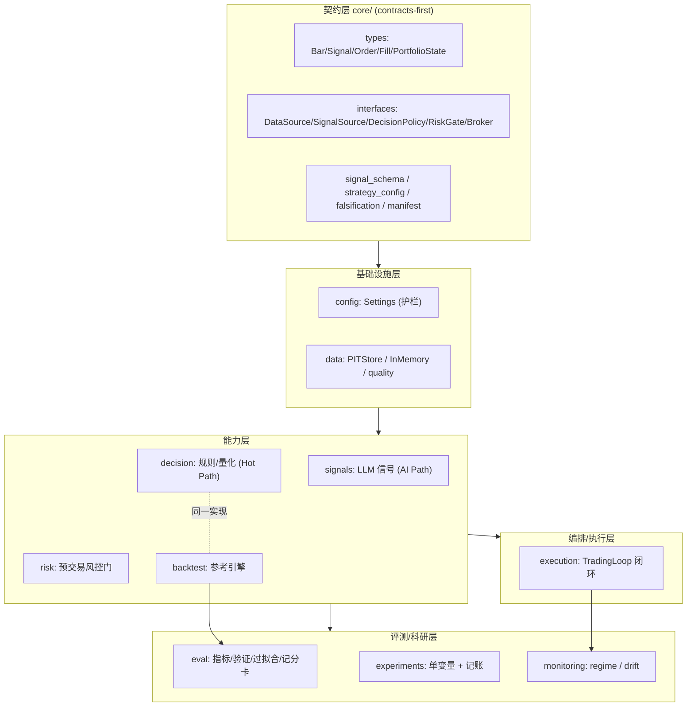
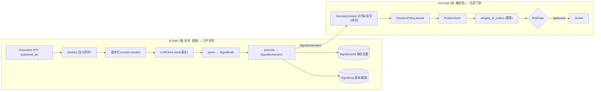
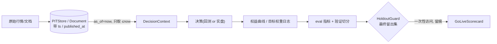
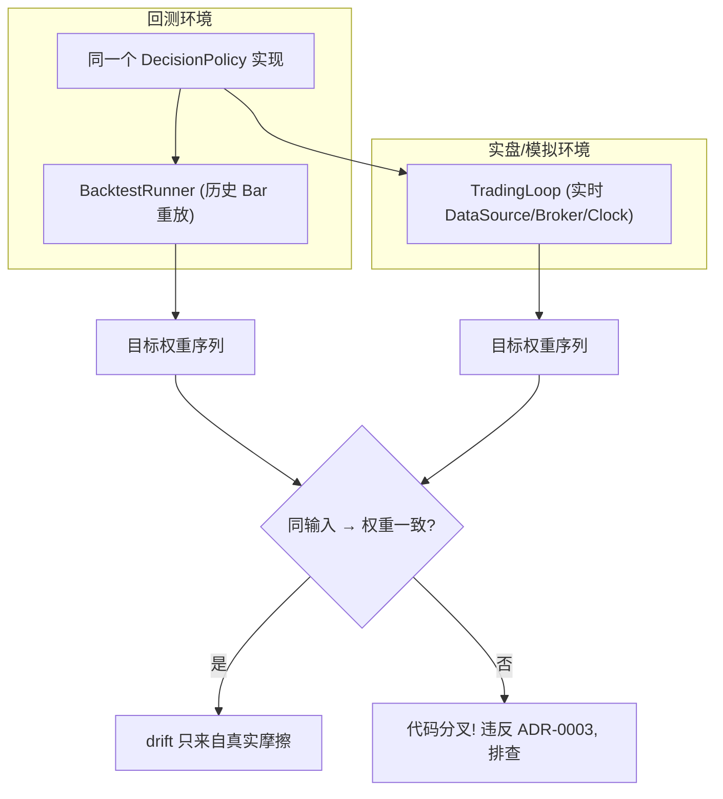
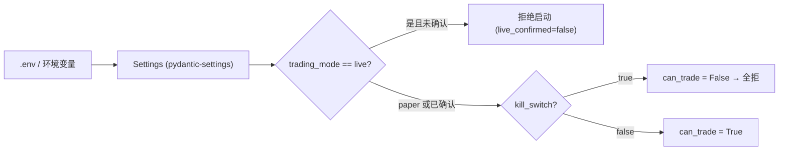

# 系统架构（Architecture）

> 本文用图 + 表说明系统的分层、模块依赖、运行时事件流与数据生命周期。定位见 [README](../README.md)、[ADR-0001](decisions/0001-llm-positioning-hybrid.md)、[ADR-0003](decisions/0003-backtest-live-parity.md)。原则：**LLM 只出信号（AI Path）· 决策与执行确定性（Hot Path）· 回测-实盘同源**。

## 1. 分层总览（Layered View）



**依赖方向**：一律自上而下依赖 `core/` 契约，禁止反向依赖；能力层之间通过 `core` 的 Protocol 解耦，便于替换实现（如 `Broker` 从 `SimulatedBroker` 换成 Nautilus 适配）。

| 层 | 包 | 稳定性 | 替换风险 |
| --- | --- | --- | --- |
| 契约层 | `core` | 高（改动波及全局） | 需版本化 schema |
| 基础设施 | `config` `data` | 中 | 数据源可插拔 |
| 能力层 | `signals` `decision` `risk` `backtest` | 中 | 实现藏在 Protocol 后 |
| 编排/执行 | `execution` | 中 | Broker 可替换 |
| 评测/科研 | `eval` `experiments` `monitoring` | 高（纯函数为主） | 低 |

## 2. Hot Path / AI Path 解耦



| | AI Path | Hot Path |
| --- | --- | --- |
| 速度 | ms–s（不可用于实时撮合） | µs–ms（确定性） |
| 频率 | 低频/异步（日线或事件触发） | 每决策周期 |
| 失败模式 | 幻觉/保守偏差/注入/成本 | 越限/漂移/崩溃 |
| 治理 | schema 校验 + 缓存 + 留痕 | 风控门 + 幂等 + 对账 |
| 可否触碰订单 | ❌ 永不 | ✅ 唯一入口 |

## 3. 运行时事件流（TradingLoop.step）

```mermaid
sequenceDiagram
    autonumber
    participant Loop as TradingLoop
    participant Data as DataSource
    participant Sig as SignalSource
    participant Pol as DecisionPolicy
    participant Risk as PreTradeRiskGate
    participant Brk as Broker
    participant Rec as Reconciler
    participant St as StateStore

    Loop->>Data: get_bars(≤now)  %% PIT, 无未来
    Loop->>Loop: 刷新价格 + 判断是否新交易日(重置日亏基线)
    Loop->>Sig: signals_as_of(now)
    Loop->>Pol: decide(ctx)
    Pol-->>Loop: TargetWeights
    Loop->>Loop: weights_to_orders (差额 + 幂等 id)
    Loop->>Risk: check(orders, portfolio)
    alt 全局闸门触发 (kill/模式/日亏熔断)
        Risk-->>Loop: 全部 denied
    else 逐单闸门
        Risk-->>Loop: approved + denied(附原因)
    end
    Loop->>Brk: submit(approved) 跳过已提交 id
    Loop->>Loop: 记录提交(持仓/现金/order ids)
    Loop->>Rec: reconcile(broker, state)
    Rec-->>Loop: ReconcileReport (漏/多单, 持仓漂移)
    Loop->>St: 原子持久化 EngineState
    Note over Loop: try/except 包裹全过程 → 异常即安全降级(本步不交易)
```

**关键不变量（均有测试）**：

- 🔒 `execution` 只提交 `RiskGate.approved` 的订单——**无旁路**。
- ♻️ 相同 `client_order_id` 幂等——重启/重放不重复成交。
- 🧾 自己刚成交的订单不会被对账误判为"意外成交"（提交先于对账）。
- 🪝 崩溃后 `load()` + 启动对账 → 状态一致。

## 4. 数据生命周期（Point-in-Time）



| 防偏差 | 机制 |
| --- | --- |
| 未来函数（look-ahead） | `as_of` 过滤：只见 `ts ≤ now` / `published_at ≤ now` |
| 幸存者偏差 | 数据集需含退市/下架标的（数据层要求） |
| 偷看留出集 | `HoldoutGuard` 访问留痕 + 默认禁反复访问 |
| 多重检验 | `ExperimentRegistry.n_trials` → 喂 `deflated_sharpe_ratio` |

## 5. 回测-实盘一致（ADR-0003）



环境差异（数据/券商/时钟）全部隔离在 `DataSource` / `Broker` / `Clock` 之后；`DecisionPolicy` 为纯函数。回归测试：`test_trading_loop::test_backtest_live_parity_same_target_weights`。

## 6. 配置与安全护栏



护栏清单见 [README §8](../README.md#8-安全护栏) 与 `.cursor/rules/10-trading-safety.mdc`。

## 7. 扩展点（Seams）——面向生产化替换

| 接缝（Protocol） | 当前实现（离线） | 生产替换（见 [MILESTONES](MILESTONES.md) M7/M8） |
| --- | --- | --- |
| `LLMClient` | `KeywordLLMClient`（关键词 stub） | OpenAI / DeepSeek / 本地 Ollama + AI gateway |
| `DataSource` | `InMemoryDataSource` / `PITStore` | 真实行情 + 新闻源（PIT 时序隔离） |
| `Broker` | `SimulatedBroker`（即时成交） | Alpaca paper / CCXT testnet；执行引擎接 Nautilus |
| `BacktestRunner` | 确定性参考引擎 | 可替换 vectorbt(研究) / Nautilus(实盘同源) |
| `StateStore` | `FileStateStore`（JSON 原子写） | SQLite / Redis |

> 正因为一切藏在 `core/` 的 Protocol 后，生产化是"替换实现"而非"重写调用方"。这是 [ADR-0002](decisions/0002-leverage-oss-vs-build.md) 的价值兑现点。
