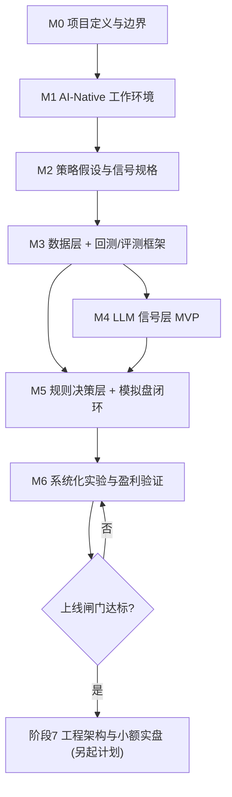
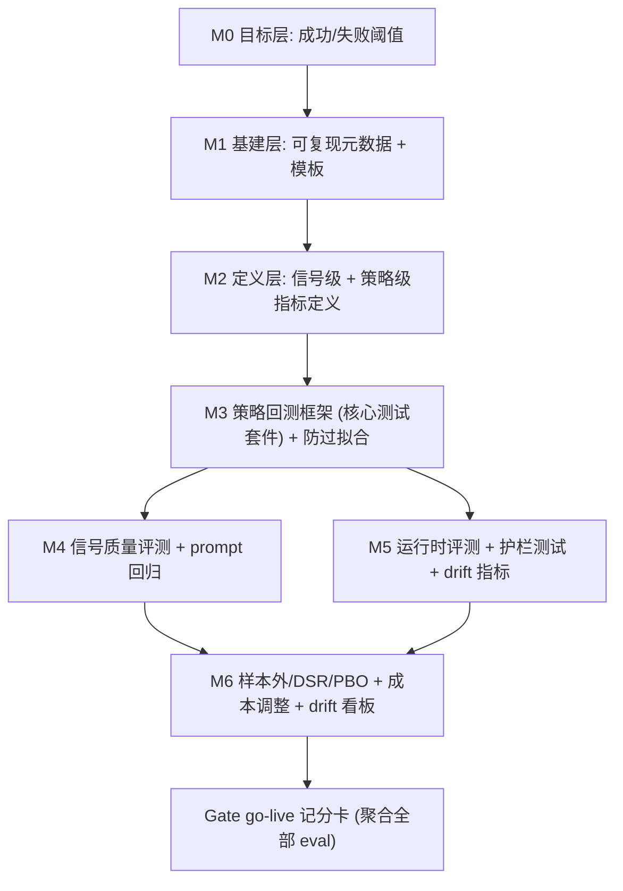

# 阶段与里程碑（Milestones）

> 本文件定义**阶段/里程碑、交付物、准出指标**。技术方案仅做简要说明，具体设计留待各里程碑内的规格文档细化。
> 架构定位：混合（LLM 信号层 + 规则/量化决策与执行层）。资金路径：回测 → 模拟盘 → 小额实盘。

每个里程碑包含：**目标**、**简要技术方案**、**交付物（明确、可验证）**、**准出指标（Exit Gate，可勾选/可量化）**、**Eval 增量（本里程碑为评测体系新增的能力）**、**依赖**。

> **详细技术方案**见 [tech-specs/](tech-specs/)：[M1](tech-specs/M1-workspace-and-tooling.md) · [M2](tech-specs/M2-strategy-and-signal-contract.md) · [M3](tech-specs/M3-data-and-backtest.md) · [Eval](tech-specs/EVAL-framework.md) · [M4](tech-specs/M4-llm-signal-layer.md) · [M5](tech-specs/M5-decision-execution-paper.md) · [M6](tech-specs/M6-experimentation-and-validation.md)。本文件是"做什么/交付什么"，技术方案是"怎么实现"。

准出指标原则：
- 尽量二元可判定或带阈值；阈值统一引用 [PROJECT_CHARTER.md](PROJECT_CHARTER.md) 的成功/失败标准（单一数据源，不在此重复维护数值）。
- 全部满足才可进入下一里程碑；未满足则留在本里程碑或回退。

## 里程碑总览

| 里程碑 | 一句话目标 | 核心交付物 | 准出指标（关键项） |
| --- | --- | --- | --- |
| M0 | 定义成功与边界 | 定稿的项目章程 + LLM 定位 ADR | 成功指标有数值且每条可映射到一个评测指标 |
| M1 | 搭好 AI-Native 工作环境 | Git + AGENTS + rules + docs 骨架 + 账号规划 | 冷启动会话能复述红线；无密钥入库 |
| M2 | 讲清怎么赚钱 | 策略假设 + 信号契约 + 标的池 | 有证伪条件；schema 足以据此写评测 |
| M3 | 建好"测试套件" | 数据层 + 回测/评测框架 + 基准报告 | 结果可复现；防过拟合机制有断言覆盖 |
| M4 | LLM 能产出有用信号 | 信号提取器 + 信号评测 + Prompt 版本化 | 信号样本外显著优于零基线 |
| M5 | 跑通模拟盘闭环 | 规则决策层 + 护栏 + 模拟盘连续运行 | 连续运行 N 天；每类护栏均触发验证 |
| M6 | 验证是否真的盈利 | 实验框架 + 样本外验证 + drift 监控 | 最终验证集达 M0 指标；净收益为正 |
| Gate | 决定是否上实盘 | 上线闸门记分卡 | 满足全部放行条件 + 人类签署 |
| 阶段7 | 工程化与小额实盘 | （另起工程计划） | — |

## Eval 体系演进（Progressive Eval System）

评测能力不是最后才补，而是随里程碑逐层长出来。每一层都建立在前一层之上，最终汇聚成上线决策的记分卡。

| 里程碑 | Eval 体系新增能力 | 层级 |
| --- | --- | --- |
| M0 | 定义评测要对齐的成功/失败阈值（后续所有判定的基准） | 目标层 |
| M1 | 可复现元数据规范（数据/代码/模型/prompt/种子版本）+ 实验/评测模板 | 基建层 |
| M2 | 指标定义：信号级（IC/命中率）+ 策略级（对齐 M0）+ 基准 | 定义层 |
| M3 | 策略回测框架（核心测试套件）+ walk-forward/purged CV/最终验证集 | 策略评测 |
| M4 | 信号质量评测 + prompt 回归评测（第二层 eval） | 信号评测 |
| M5 | 运行时/在线评测 + 护栏触发测试 + live-vs-backtest drift 指标 | 运行时评测 |
| M6 | 样本外 DSR/PBO + 成本调整评测 + drift 监控看板 | 稳健性评测 |
| Gate | go-live 记分卡：聚合上述全部 eval 做单一放行判定 | 汇总层 |

---

## M0 · 项目定义与边界

- **目标**：把"什么算成功""不做什么"钉死，避免人与代理跑偏。
- **简要技术方案**：纯文档，无代码。
- **交付物**：
  - [docs/PROJECT_CHARTER.md](PROJECT_CHARTER.md) 定稿：成功指标填入**具体数值**（年化、最大回撤上限、Sharpe/DSR 下限、相对基准超额）、失败/放弃标准、Edge 假设与证伪方式、Non-goals、预算上限、决策频率区间。
  - [docs/decisions/0001-llm-positioning-hybrid.md](decisions/0001-llm-positioning-hybrid.md)：混合定位决策记录（已起草，M0 复核确认）。
  - 一份"开放决策清单"及其截止里程碑。
- **准出指标（Exit Gate）**：
  - [ ] 成功指标无 `TODO`，全部为具体数值。
  - [ ] 每条成功指标都能映射到**一个可计算的评测指标**（即可证伪）。
  - [ ] 失败/放弃标准 ≥ 3 条且均可客观判定。
  - [ ] Non-goals 与开放决策清单无歧义，人类签署确认。
- **Eval 增量**：确立评测要对齐的目标阈值（成功/失败线），成为后续所有 eval 的判定基准。
- **依赖**：无。

## M1 · AI-Native 工作环境与仓库骨架

- **目标**：让构建期代理拥有稳定、持久的上下文与安全约束。
- **简要技术方案**：Git + Markdown 上下文文件 + Cursor rules；账号/密钥先规划不写代码。
- **交付物**：
  - Git 初始化：`main` 保护策略、分支命名约定、Conventional Commits 约定、`.gitignore`（密钥/数据/产物）。
  - 代理上下文：`AGENTS.md`、`.cursor/rules/`（项目上下文 / 交易安全 / 研究严谨性 / 工作流）、`docs/GLOSSARY.md`。
  - 文档骨架：`docs/specs/`、`docs/decisions/`（含 ADR 模板）、`docs/experiments/`（含实验模板）。
  - 账号与密钥规划清单：模拟盘券商、历史/实时行情源、新闻/基本面源、LLM 供应商；`.env.example` 约定。
  - `README.md`：项目概览与文档地图。
  - **可复现元数据规范**：约定每次实验/评测需记录的字段（数据版本、代码 commit、模型/prompt 版本、温度、随机种子、参数）。
- **准出指标（Exit Gate）**：
  - [ ] 冷启动验证：全新会话仅凭仓库文件能正确复述项目意图、架构红线、两层代理边界。
  - [ ] 密钥扫描：仓库无任何真实密钥入库；`.env.example` 覆盖全部所需密钥类别。
  - [ ] `.cursor/rules/` 全部生效；分支/提交约定已文档化。
  - [ ] docs 骨架与模板齐全（specs / decisions / experiments）。
- **Eval 增量**：建立可复现元数据规范与实验/评测模板——所有后续 eval 可复现的前提（此时先立规范与模板，尚未实现评测）。
- **依赖**：M0。

## M2 · 策略假设与信号规格

- **目标**：把"Agent 到底怎么赚钱"变成可回测、可证伪的假设。
- **简要技术方案**：规格文档，定义 LLM 信号层输出与规则决策层输入的契约。
- **交付物**：
  - [docs/specs/strategy-hypothesis.md](specs/strategy-hypothesis.md)：Edge 假设、失效条件、基准与评估指标、决策周期、动作空间（买/卖/持有/目标仓位）。
  - 初始标的池（5–15 个高流动性美股/ETF/加密），及选取理由。
  - [docs/specs/llm-signal.md](specs/llm-signal.md)：**信号契约**——LLM 输入（哪些非结构化信息、来源、频率）、输出 schema（因子字段、取值范围、置信度）、更新频率。
  - 规则/量化决策层如何消费信号的初步规格（信号 → 仓位映射的口径，细节留 M5）。
  - **评测指标定义**：信号级指标（如 IC、命中率、分层收益）与策略级指标（对齐 M0）的口径与显著性判据。
- **准出指标（Exit Gate）**：
  - [ ] Edge 假设有 ≥ 1 条明确、可判定的证伪条件。
  - [ ] 信号输出 schema 明确到"能据此直接写出评测脚本"（字段、取值范围、置信度齐全）。
  - [ ] 标的池确定（5–15 个），基准（SPY / BTC）确定。
  - [ ] 信号级与策略级评测指标定义 + 显著性判据均已写入规格。
- **Eval 增量**：确定"要测什么、怎么算分、多少算显著"（信号级 + 策略级指标定义与基准），为 M3/M4 的实现提供口径。
- **依赖**：M1。

## M3 · 数据层 + 回测/评测框架（关键安全网）

- **目标**：先建"测试套件"，让后续所有策略/信号改动都能被客观判定。这是全项目最需严格验证的组件。
- **简要技术方案**：point-in-time 数据存储 + 确定性回测引擎（**优先复用成熟引擎，见 ADR-0002**）+ 过拟合防护 + 一键报告；**统一决策接口**为回测-实盘一致打基础（ADR-0003）。
- **交付物**：
  - [docs/specs/backtest-eval.md](specs/backtest-eval.md) 定稿。
  - **数据层**：历史行情/新闻/基本面的获取与存储规范；point-in-time 纪律（只用当时可得数据）；显式防幸存者偏差；数据字典填入 `GLOSSARY.md`。
  - **回测引擎**：优先复用成熟引擎（bt / vectorbt / Nautilus / Qlib，见 [LANDSCAPE.md](LANDSCAPE.md)）而非手搓；确定性/可复现（固定随机种子、时间对齐、无未来函数）；**真实成本建模**（手续费、滑点、流动性/成交假设）。
  - **统一决策接口**：定义"信号+行情 → 目标仓位/订单"的单一接口，使**同一套决策代码**既能回测又能（M5）在模拟盘运行，drift 只来自真实摩擦而非代码分叉。
  - **过拟合防护机制**：walk-forward、purged/embargoed 交叉验证、留出"最终验证集"（永不用于调参）、DSR/PBO 指标。
  - **评测报告**：收益/回撤/胜率/换手/成本，及相对基准的一键报告；结果可复现（记录数据版本、代码版本、参数）。
  - **多基准跑通**：SPY / BTC 买入持有 + 一个纯价量/技术基线，均在框架内可复现运行并出报告（为 Edge 证伪做准备）。
  - **已知答案回归用例**：一个合成数据集，其正确回测结果已知，用于防未来函数/计算错误的回归测试。
- **准出指标（Exit Gate）**：
  - [x] 可复现：同一输入两次运行，指标级结果 diff = 0（或 < 明确容差）。→ `test_backtest_runner::test_reproducible_same_inputs_same_output`
  - [~] 多基准（SPY / BTC / 价量基线）**策略**可在框架内复现运行（`SingleAssetBuyHoldPolicy` / `PriceOnlyMomentumPolicy`）；**一键报告**待 EVAL 里程碑。
  - [ ] walk-forward + purged/embargoed CV + 最终验证集隔离，均在框架中强制且有**测试/断言覆盖**。→ 归属 EVAL 里程碑。
  - [~] 成本模型参数化且有默认值（`CostModel`，已覆盖单调性测试）；报告含 DSR / PBO 字段 → 待 EVAL。
  - [x] "已知答案"合成用例回测结果符合预期。→ `tests/golden/test_backtest_known_answer.py`
  - [x] 统一决策接口就位（同一决策函数可被回测与执行层调用）。→ `DecisionPolicy` 被 `BacktestRunner` 驱动。
- **实现状态（本次落地）**：
  - ✅ 已落地：PIT 数据存储 `PITStore`（parquet，`as_of` 过滤）+ `InMemoryDataSource` + 数据质量检查 `check_bars`；确定性参考回测引擎 `BacktestRunner`（无未来函数、成本建模、可复现）；统一 `DecisionPolicy` 接口 + 4 个参考/基线策略；基础指标 `total_return/max_drawdown/sharpe`；golden 已知答案回归 + PIT 断言测试。43 项测试全绿。
  - 🔜 归属 EVAL 里程碑：walk-forward / purged CV / 最终验证集、DSR/PBO、一键多基准报告。
  - 关于引擎复用（ADR-0002）：本次先落地**受控的确定性参考引擎**（藏在 `BacktestRunner`/`DecisionPolicy` 接口后），保留后续替换 vectorbt/bt 的接缝而不影响调用方与决策语义。
- **Eval 增量**：**策略级评测框架（核心测试套件）上线**——此后任何策略改动都能被客观打分；防过拟合流程强制化（EVAL 里程碑续建）；确立回测-实盘一致基础。
- **依赖**：M2。

## M4 · LLM 信号层 MVP

- **目标**：验证 LLM 能从非结构化信息中产出**有增量价值**的结构化信号。
- **简要技术方案**：LLM 读新闻/财报/公告 → 按 `llm-signal.md` schema 输出因子；对信号本身做独立评测。
- **交付物**：
  - 信号提取器：输入非结构化信息，输出结构化信号（符合 M2 schema）。
  - **信号评测**：独立于交易盈亏，衡量信号质量（如信号对未来收益的预测力 IC/命中率），并与"零基线/随机基线"及"纯价量基线"对比（检验是否只是复述已被定价的信息）。
  - **保守偏差检查**：评估 LLM 是否系统性偏向"谨慎/看空"（已知失败模式），必要时在 prompt/校准层纠偏。
  - **Prompt 版本化与可复现**：固定并记录 prompt、模型版本、温度；同输入可复现。
  - **prompt 回归评测**：prompt 变更自动触发信号评测对比，防止"改好一个坏一片"。
  - **多后端成本对比**：至少对比一个昂贵后端与一个便宜后端（DeepSeek/本地 Ollama），评估质量-成本权衡。
  - **决策/信号留痕**：每条信号连同输入摘要、模型版本、推理理由入日志。
  - **成本记录**：每次 LLM 调用的 token/成本统计。
  - prompt 注入的基础防护（输入隔离/校验）。
- **准出指标（Exit Gate）**：
  - [~] 信号在**样本外**的预测力（IC/命中率）**显著优于零基线且优于纯价量基线**：评测函数 `evaluate_signal`(IC/rank-IC/命中率/t 统计量)已就位；**真实信号跑分待接入真实后端 + 数据源**。
  - [x] 已（有能力）评估保守偏差：`check_conservatism` 检测系统性偏空/偏低置信。
  - [x] 可复现：固定 model/prompt/温度（离线 stub temperature=0，指纹缓存）→ 同输入同输出，有测试覆盖。
  - [x] 100% 信号有留痕：`SignalLog`(jsonl) 记录模型/prompt 版本、理由、token/成本、可疑注入计数。
  - [~] 单位信号成本可量化：`LLMResponse.cost_usd` + `SignalLog.total_cost` 已量化；便宜后端结论待接真实后端对比。
  - [ ] prompt 回归评测可用：prompt 已版本化 + schema 校验；自动回归对比编排待 EVAL 里程碑接线。
- **实现状态（本次落地，离线优先）**：
  - ✅ 已落地（**零真实 LLM 调用**，适配本机算力受限）：供应商无关 `LLMClient` 协议 + 离线确定性 `KeywordLLMClient` stub；`Document`(PIT) + 注入防护 `build_documents_block`；版本化 prompt 加载/渲染 + schema 校验；`SentimentExtractor`(PIT 过滤 + 解析重试 + 由提取器补齐 as_of/版本 → `SignalSchemaV1`)；指纹缓存 `SignalCache`；留痕/成本 `SignalLog`；`LLMSignalSource` 接入 M3 回测（端到端已测）；`signal_eval`(IC/rank-IC/命中率/显著性) + 保守偏差检查。74 项测试全绿。
  - 🔜 待接线（需真实后端/数据/预算）：真实 LLM 客户端(OpenAI/Anthropic/DeepSeek/Ollama)、新闻/财报数据源(带 published_at)、便宜 vs 昂贵后端质量-成本对比、prompt 回归评测自动编排。**接口已就绪，替换 stub 即可，无需改提取器/评测。**
- **Eval 增量**：**信号质量评测（第二层 eval，独立于盈亏）上线**；prompt 回归自动编排随 EVAL 续建。
- **依赖**：M3（评测框架）、M2（信号契约）。

## M5 · 规则/量化决策层 + 模拟盘闭环

- **目标**：跑通 observe → LLM 信号 → 规则/量化决策 → **预交易风控门** → 模拟盘执行 → 对账 → 记录 的完整闭环。
- **简要技术方案**：**复用 M3 的统一决策接口**（回测-实盘一致，ADR-0003）；确定性规则/量化层消费信号 + 行情产出目标仓位；所有订单经预交易风控门后在模拟盘执行；全程护栏 + 对账 + 可恢复。
- **交付物**：
  - **决策层**：信号 + 价量 → 目标仓位的确定性规则/量化逻辑；含**仓位管理**（波动率目标 / 分数 Kelly 等，具体在此定）。**复用 M3 决策接口**，确保与回测同一套代码路径。
  - **预交易风控门（Pre-trade Risk Gate）**：所有订单必过的独立校验——单笔/总仓位限额、名义金额限额、**下单频率限额**；不通过即拒绝（OrderDenied）并留痕。借鉴 Nautilus RiskEngine / FinRL-X 三级风控（见 [LANDSCAPE.md](LANDSCAPE.md)）。
  - **风险护栏**：每日亏损熔断、异常/超时降级、全局 **kill switch**；`TRADING_MODE=paper` 默认。
  - **执行对账（Reconciliation）**：模拟盘版——内部订单/持仓状态与券商回报对齐，检测漏单/重复成交/状态不一致。
  - **崩溃恢复/状态持久化**：进程重启后可从持久化状态恢复（crash-only 设计雏形），不产生重复/丢失订单。
  - **模拟盘执行**：对接模拟盘券商，连续运行。
  - **人类检查点 + 全量留痕**：关键动作可人工复核；每笔交易记录信号、决策依据、执行结果。
  - **live-vs-backtest 记录 + drift 指标**：模拟盘表现与回测预期的对比数据开始积累并计算 drift。
  - **护栏/对账触发测试**：可注入异常/极端场景验证每类护栏与对账逻辑。
- **准出指标（Exit Gate）**：
  - [ ] 模拟盘闭环连续稳定运行 ≥ N 天（N 定值），无未捕获异常。
  - [ ] **无任何订单绕过预交易风控门**（有断言/测试覆盖）；每类护栏（限额 / 频率 / 日亏熔断 / 超时降级 / kill switch）均有一次"注入触发"测试并确实生效。
  - [ ] 对账能检出注入的状态不一致；进程重启后状态正确恢复且不重复下单。
  - [ ] 决策代码路径与 M3 回测一致（同一接口），有验证。
  - [ ] 100% 交易可追溯到触发信号与决策依据。
  - [ ] 已开始产出 live-vs-backtest drift 指标。
- **Eval 增量**：**运行时/在线评测 + 护栏/对账触发测试 + drift 指标上线**（第三层 eval）。
- **依赖**：M4（信号）、M3（回测口径与决策接口一致）。

## M6 · 系统化实验迭代与盈利验证

- **目标**：用系统化实验逼近 M0 成功指标，并确认盈利是**样本外可复现**而非过拟合。
- **简要技术方案**：单变量实验 + 样本外/walk-forward 验证 + drift 监控 + 成本调整后收益。
- **交付物**：
  - **实验框架**：一次改一个变量（prompt / 信息源 / 因子 / 仓位规则），对照基准评估；结果写入 `docs/experiments/`（假设→设置→结果→结论）。
  - **样本外验证**：在最终验证集上确认表现，报告 DSR/PBO。
  - **开源框架对照基准**：将候选策略与一个开源框架基线（TradingAgents / ai-hedge-fund / FinRL）在同一区间对比，作为现实性校验（见 [LANDSCAPE.md](LANDSCAPE.md)）。
  - **regime / 模型衰减检测**：监测分布漂移与策略失效信号；定义**刷新/退役策略的触发条件**（何时重估、重训、下线）。
  - **drift 监控看板**：持续对比模拟盘与回测偏离，超阈告警。
  - **成本调整收益**：扣除滑点/手续费/LLM/数据成本后的净表现。
  - 候选策略：达到或逼近 M0 成功指标的配置及其完整实验证据链。
- **准出指标（Exit Gate）**：
  - [ ] 候选策略在**最终验证集**（从未用于调参）上满足 M0 全部成功指标。
  - [ ] 样本外**同时跑赢**：买入持有基准、纯价量基线、开源框架基线（对齐 CHARTER 的 Edge 证伪）。
  - [ ] DSR / PBO 达到 M0 设定门槛（过拟合概率可接受）。
  - [ ] 扣除全部成本（滑点/手续费/LLM/数据）后净收益为正。
  - [ ] drift 在阈值内；regime 衰减检测与刷新/退役触发条件已定义。
  - [ ] 有 ≥ N 条实验记录构成完整证据链。
- **Eval 增量**：**样本外/过拟合评测 + 开源基准对照 + 成本调整评测 + regime/drift 监控看板成型**，评测体系完整闭合。
- **依赖**：M5。

## 上线闸门（Go-live Gate：模拟盘 → 小额实盘）

- **目标**：客观决定是否投入真实资金。
- **简要技术方案**：把前述各层 eval 聚合成单一"go-live 记分卡"，逐条判定。
- **放行条件（全部满足）**：
  - 连续 N 周模拟盘满足：超额收益 > 基准、最大回撤 < 上限、无重大护栏误触发。
  - 样本外指标达标（含 DSR/PBO）。
  - 监控/告警、异常处置预案（incident playbook）就位。
  - live-vs-backtest drift 在阈值内。
  - 明确初始实盘资金上限与逐步放量规则。
  - 人类明确签署批准。
- **交付物**：上线闸门评审报告（go-live 记分卡）+ go/no-go 决定记录（写入 `docs/decisions/`）。
- **Eval 增量**：**go-live 记分卡**——聚合全部 eval 做单一放行判定。

## 阶段 7 · 工程架构与小额实盘（另起计划）

- 达成上线闸门后，另起一份**工程设计计划**：模块划分、数据管道、执行引擎、部署与可观测性、实盘接入、逐步放量与回滚预案。本里程碑文档不展开工程实现细节。
- 需在此阶段**强化到生产级**（把 M5 的雏形做扎实，见 [LANDSCAPE.md](LANDSCAPE.md)）：完整执行对账、崩溃恢复/状态持久化（如 Redis）、预交易风控引擎、回测-实盘代码零分叉、集中式日志/监控/告警与优雅停机、实盘密钥隔离。
