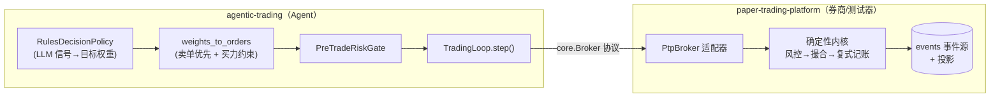

# 模拟盘平台集成与差距分析（agentic-trading ↔ paper-trading-platform）

> 目的：把 `agentic-trading`（策略/决策 **Agent**）接到 [`paper-trading-platform`](../../paper-trading-platform)（PTP，模拟**券商/交易所** + AI-Agent 测试器），用一个**会校验买力、复式记账、事件溯源**的真实券商语义环境反复验证策略；并据集成运行结果反思、修复工程缺陷。
>
> 关系：**agentic-trading = 上游 Agent（只决策）**；**PTP = 下游被接入方（撮合/记账/风控/回放）**。PTP 的 `PtpBroker` 适配器实现 agentic-trading 的 `core.Broker` 协议，其 `TradingLoop` 可**无改造**跑在 PTP 上，直接替代 Alpaca paper（Robinhood 不支持 paper）。

## 1. 拓扑与契约



### `core.Broker` 契约（agentic-trading 定义，PTP 适配）

| 方法 | 语义 | PTP 适配要点 |
| --- | --- | --- |
| `submit(order)` | 幂等提交（按 `client_order_id` 去重） | 映射为 `OrderRequest`，内核按 coid 去重 |
| `advance(now)` | 推进撮合步，返回本步成交 | `paper` 画像即时成交 → no-op（成交已在 submit 完成） |
| `get_positions()` | 返回 `PortfolioState`（cash/positions/equity） | 盯市后读账户视图 |
| `get_open_orders()` | 未成交挂单 | 读订单投影 `leaves_qty` |
| `get_fills(since)` | 增量成交回报 | 读成交投影，`sim_ts ≥ since` |

> **契约变更提示**：`advance(now)` 是 [ADR-0010](decisions/0010-architecture-hardening.md) 为接入高保真 broker 新增到协议的方法。任何外部 `Broker` 实现（含 `PtpBroker`）都须提供它——PTP 已适配（`paper` 画像下为 no-op）。这是对已发布契约的一次**破坏性变更**，跨项目共演化时需同步。

## 2. 如何运行集成

```bash
# 1) 在 PTP 的环境中安装本项目（editable）
cd ../paper-trading-platform
VIRTUAL_ENV=.venv uv pip install -e ../agentic-trading

# 2) 跑 PTP 全量套件（含此前 skip 的 agentic 集成契约测试）
.venv/bin/python -m pytest -q            # 131 passed（agentic 集成 3 项由 skip 转 pass）

# 3) 端到端 Demo（多标的动量轮动，自带对账 + 权益不变量自校验）
.venv/bin/python examples/run_agentic_trading.py       # 最小闭环
.venv/bin/python examples/demo_agentic_complex.py      # 复杂：4 段市场态势 × 3 组风控参数
```

## 3. 集成暴露的工程缺陷 → 已修复

### 缺陷：买力不足拒单（`insufficient_buying_power`）

| 现象 | 复杂 Demo 每轮 88–95 单中 **19–23 单被 PTP 拒**，拒因 100% 为 `insufficient_buying_power`；成交率仅 ~76%。 |
| --- | --- |
| **根因 1** | `weights_to_orders` 按**标的字母序**混排买卖单。再平衡时买单（如 AAPL）可能先于卖单（如 NVDA）提交；PTP 会校验买力 → 卖单回款尚未到账，买单即被拒。 |
| **根因 2** | 策略目标常为**满仓**（gross=1.0），留存现金≈0；最后一笔买单因成交价/量子取整漂移**超出可用现金几分钱**而被拒。 |
| **为何我方测试未发现** | agentic 的 `SimulatedBroker`/`RealisticBroker` **不校验买力**（买单可使现金为负），掩盖了该问题。PTP 复式记账 + 买力校验才把它暴露出来——这正是接入真实券商语义环境的价值。 |

### 修复（`src/atrading/execution/order_gen.py`）

1. **卖单优先**：返回列表中所有 `sell` 排在 `buy` 之前——再平衡先卖出释放现金，再买入。
2. **买力约束**：买单累计名义受限于**可用买力 = 当前现金 + 卖单回款**，并预留 `cash_buffer`（默认 0.5%）吸收取整/成交漂移；超出部分对最后一笔买单**缩量**（部分再平衡），再不足则跳过。

### 效果（同一 Demo，修复前 → 修复后）

| 轮次 | 修复前 拒单 | 修复后 拒单 | 修复后成交率 |
| --- | --- | --- | --- |
| run1_balanced | 19 | **0** | 100% |
| run2_concentrated | 23 | **0** | 100% |
| run3_tight_riskguard | 21 | **0** | 100% |

回归防护（不依赖 PTP，纳入本项目 CI）：

- `tests/unit/test_order_gen.py::test_sells_are_ordered_before_buys`
- `tests/unit/test_order_gen.py::test_buys_capped_to_available_buying_power`
- `tests/unit/test_buying_power.py`（用会拒超买单的 fake broker 跑满仓再平衡，断言零拒单）

## 4. 差距分析：距"生产级模拟盘 / AI-Agent 测试器"还差什么

> 说明：**执行真实性（撮合/记账/买力/事件溯源/回放）由 PTP 承担**——这是本架构的分工。以下按"agentic-trading 作为接入方"与"组合系统"两个视角列差距。

| # | 维度 | 现状 | 差距 | 优先级 | 归属 |
| --- | --- | --- | --- | --- | --- |
| P1 | **买力/资金约束** | 已修复：卖单优先 + 买力缩量 | 未建模融资/做空保证金、T+N 结算、可用 vs 结算资金 | 🟠 | AT |
| P2 | **数量量子化** | 发出 float 股数，依赖下游券商量子归一 | AT 侧不感知 lot/最小变动，可能触发下游二次调整/拒单 | 🟠 | AT |
| P3 | **订单类型** | 仅 `market`（`weights_to_orders`） | 无 limit/stop/IOC/FOK/TWAP；PTP 已支持 limit+TIF，AT 未利用 | 🟠 | AT |
| P4 | **broker 语义保真** | AT 的 Sim/Realistic broker 不校验买力 | 无法在 AT 单测内复现真实拒单；须靠 PTP 集成 | 🟡 | AT/测试 |
| P5 | **多账户/多币种** | `core.Broker` 无账户维度；单币种 | PTP 有多账户/资金管理；AT 侧无 | 🟡 | AT |
| P6 | **契约版本化** | `Broker` 协议破坏性演进（新增 `advance`） | 缺少契约版本/兼容层，跨项目易漂移 | 🟠 | AT |
| P7 | **实时/异步** | 同步 `step/tick`（决定论优先，ADR-0010） | 无实时调度/多标的并发；属真实基建 | 🔴 | AT/基建 |
| P8 | **真实数据/券商** | 全离线合成/stub | 真实行情、真实券商（PTP 替代 paper） | 🔴 | AT（M7/M8） |
| P9 | **公司行为** | 无分红/拆股/退市处理 | 影响长周期持仓正确性 | 🔴 | AT/PTP |
| P10 | **端到端可观测** | AT 指标/tracing 已具；跨进程 trace 未打通到 PTP | AT↔PTP 的 `trace_id` 关联缺失 | 🟡 | AT+PTP |

### 本轮已提升

- **P1 买力约束**（核心缺陷，见 §3）：卖单优先 + 买力缩量 + 回归测试。
- **文档**：本集成规格 + 差距矩阵 + [ADR-0011](decisions/0011-execution-ordering-and-buying-power.md)。
- **验证口径**：把"PTP 集成 + 复杂 Demo 零拒单/零权益不变量违背"确立为**执行真实性的验收信号**（补足 AT 侧 broker 不校验买力的盲区）。

### 建议后续（按优先级）

1. **P3 订单类型 + P2 量子化**：`weights_to_orders` 支持 limit/TIF 与 lot/最小变动感知（利用 PTP 已有能力，减少下游二次调整）。
2. **P6 契约版本化**：给 `core.Broker` 加版本标记与兼容层，跨项目共演化不再"隐式破坏"。
3. **P1 深化**：做空/保证金/结算资金建模（先在 PTP 侧，再由 AT 感知）。
4. **P10 跨进程 tracing**：AT 的 `Tracer` 与 PTP 的 `trace_id` 贯通，端到端定位慢/错。

## 5. 关联

- 决策：[ADR-0011](decisions/0011-execution-ordering-and-buying-power.md)（执行排序与买力约束）、[ADR-0010](decisions/0010-architecture-hardening.md)（`advance` 契约）、[ADR-0003](decisions/0003-backtest-live-parity.md)（回测-实盘一致）。
- 生产差距全景：[PRODUCTION-READINESS.md](PRODUCTION-READINESS.md)。
- PTP 侧集成规格：`paper-trading-platform/docs/tech-specs/integration-agentic-trading.md`。
