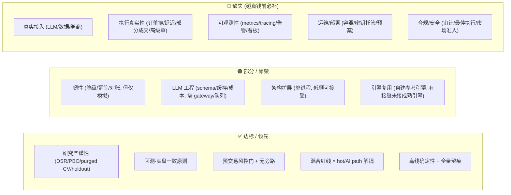

# 生产就绪度评估（Production Readiness）

> 调研日期：2026-07。目的：对照 2026 生产级 trading 系统标准与成熟开源项目，量化"研究验证级骨架" → "能碰真钱的生产级 agent"之间的差距，并据此排定 M7–M10 路线。
> 参考：[Nautilus](https://nautilustrader.io/) · [Lean/QuantConnect](https://tradingl.com/algo-trading/open-source-trading-engines/) · [vectorbt 2026 对比](https://aifinhub.io/articles/best-backtesting-framework-python-2026/) · [Building a Production-Grade Trading System 2026](https://dev.to/patexone_richarde/building-a-production-grade-algorithmic-trading-system-in-2026-45o1) · [Risk Controls Must Ship First](https://hftadvisory.substack.com/p/trading-infrastructure-sequencing) · [Why AI Agents Fail in Production 2026](https://dev.to/hadil/why-ai-agents-fail-in-production-and-how-engineering-teams-are-fixing-it-in-2026-job)。

## 1. 一句话结论

**研究正确性 + 安全设计已达/超过多数开源项目；但"真实接入 + 执行真实性 + 运维/合规"三块生产骨头尚未啃。** 根因：目前一切离线/模拟（无真实 LLM / 数据 / 券商）。按项目纪律，真实 alpha 证据（M7）跑通前，不应急于重工程。

## 2. 成熟度雷达（自评）

## 3. 差距矩阵（生产标准 → 我们现状）

| # | 维度 | 生产标准（2026） | 我们现状 | 差距 | 归属 |
| --- | --- | --- | --- | --- | --- |
| G1 | **真实接入** | 真实券商(IBKR/Alpaca/CCXT)、行情/新闻、真实 LLM | 全 stub/模拟 | 🔴 | M7/M8 |
| G2 | **执行真实性** | 订单簿深度、延迟、部分成交、IOC/FOK/OCO/TWAP、撮合/费用模型 | 即时按收盘全成交、仅 market、bps 换手成本 | 🔴 | M8 |
| G3 | **LLM 生产工程** | AI gateway(失败转移/路由/缓存)、优先级队列、小/量化模型、RAG 时序隔离、输出守卫 | schema/注入防护/指纹缓存/成本记录（无 gateway/队列/实时节流） | 🟠 | M7 |
| G4 | **可观测性** | OpenTelemetry tracing + Prometheus + Grafana、逐步 span、延迟/错误率、行为漂移告警 | 结构化日志 + StepReport/SignalLog（无 metrics/tracing/看板/告警） | 🔴 | M9 |
| G5 | **架构/扩展** | 事件驱动 + 消息总线(Kafka/Redpanda/NATS)、CQRS、物化视图、Redis 状态 | 单进程同步循环、文件 JSON、parquet | 🟠 | M8/M9（低频可延后） |
| G6 | **韧性** | 自动重试、断路器、连接恢复、故障转移、优雅降级 | 安全降级 + 幂等恢复（无真实重试/连接恢复/故障转移） | 🟠 | M8/M9 |
| G7 | **部署/运维** | Docker/K8s、CI/CD、密钥托管(Vault/HSM)、审计日志、on-call/incident playbook | 仅质量门禁 CI | 🔴 | M9 |
| G8 | **合规/安全** | 市场准入(SEC 15c3-5/MiFID II 17/CFTC)、最佳执行、审计追踪、税务批次、访问控制 | `.env` 隔离 + 护栏（无合规级审计/最佳执行） | 🔴 | M10 |
| G9 | **成熟引擎复用** | Nautilus(执行) / vectorbt(研究) / Lean(多资产) | 自建参考引擎（藏在接口后，未接成熟引擎） | 🟡 | M8（接缝已留, ADR-0002） |

## 4. 值得"抄"的开源项目（2026）

| 项目 | 抄什么 | 用在哪 |
| --- | --- | --- |
| [NautilusTrader](https://nautilustrader.io/)（Rust 核 + Python） | 事件驱动 · 纳秒时钟 · 订单簿/延迟/费用建模 · `RiskEngine`/`LiveExecutionEngine`/`OrderEmulator` · 事件溯源回放 · 回测-实盘零改代码 | **M8 执行引擎首选**：接 `core.Broker`/`DecisionPolicy` |
| [vectorbt (PRO)](https://aifinhub.io/articles/best-backtesting-framework-python-2026/) | Numba 向量化，秒级百万次参数扫描/walk-forward | EVAL/M6 研究加速后端 |
| [Lean / QuantConnect](https://tradingl.com/algo-trading/open-source-trading-engines/) | 多资产上线、公司行为/分红、"回测≈实盘 99.9%" | M8/M10 多资产实盘备选 |
| [freqtrade](https://www.youngju.dev/blog/culture/2026-05-16-trading-bots-quant-tools-2026-lean-quantconnect-backtrader-zipline-freqtrade-hummingbot-nautilus-vectorbt-deep-dive.en) | CCXT 100+ 交易所、hyperopt、Telegram 运维 | M7/M8 加密路径参考 |
| TradingAgents / ai-hedge-fund / FinRL-X | 多智能体信号视角、数据回退+缓存、三级风控 | M7 信号层对照基线（[LANDSCAPE](LANDSCAPE.md)） |

## 5. LLM-agent 特有生产坑（M7 需处理）

| 坑 | 现象 | 对策 |
| --- | --- | --- |
| 实时不可行 | 每 tick 调 LLM 经济/延迟双爆 | 优先级队列（异常大者先算，高波动跳过并标注"AI paused"） |
| 供应商路由混乱 | 各家延迟/限流/行为不一致 | AI gateway：失败转移 + 缓存 + 路由 + 预算熔断 |
| RAG 前视泄漏 | 回测查"近期新闻"误取未来文档 → Sharpe 作废 | 时间作主键（`published_at ≤ as_of`），非事后 metadata 过滤 |
| 输出漂移/幻觉 | 跨模型 prompt 行为变化、幻觉工具调用 | 每 phase 边界 schema 守卫（已具雏形，需运行时强化） |
| 线上行为漂移 | 上线后信号质量悄悄衰减 | eval 接线上数据 + `RegimeMonitor`/`drift`（骨架已具） |

## 6. 路线排序原则（见 [ADR-0008](decisions/0008-production-roadmap-and-oss-adoption.md)）

1. **先真实 alpha 证据（M7）** —— 最高杠杆。没有真实 alpha 前，重工程都是过早优化。
2. **再执行真实性（M8，采用 Nautilus）** —— 一次拿到执行保真 + 回测-实盘同源。
3. **并行补可观测性/运维（M9）** —— 碰真钱的硬前置。
4. **最后合规 + 小额实盘（M10）** —— 上线闸门 + 逐步放量。

> 详细里程碑与准出指标见 [MILESTONES.md](MILESTONES.md#生产化里程碑m7m10)。
