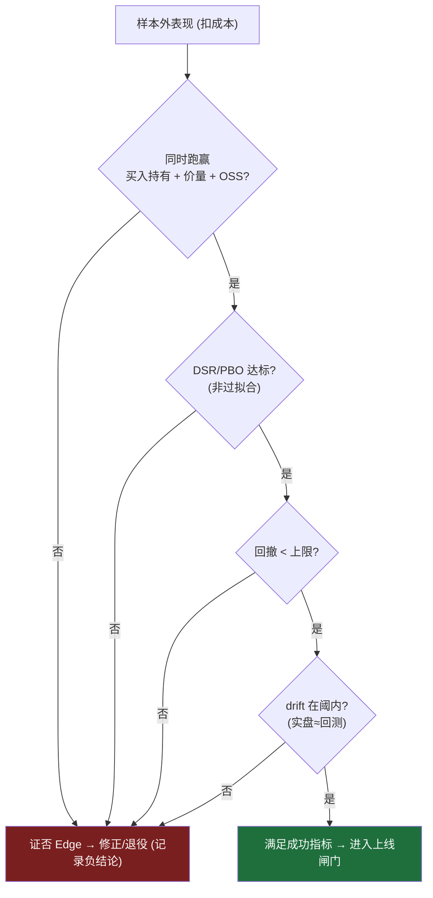

# 项目章程（Project Charter）

> 本文件定义"什么算成功""不做什么"，是所有人与代理的对齐基线。带 `TODO(值)` 的项需在里程碑 M0 拍板确定。

## 1. 愿景 / 使命

构建一个混合架构的 Agentic 交易系统，在严格的回测与模拟盘验证下追求**可持续、可复现**的盈利，而非一次性运气。

## 2. AI 定位（架构红线）

**混合架构**：LLM 只做非结构化信息 → 结构化信号/因子的提取；决策与执行由确定性的规则/量化层完成。运行时 LLM 不直接下单。理由见 [decisions/0001-llm-positioning-hybrid.md](decisions/0001-llm-positioning-hybrid.md)。

## 3. 标的与市场

- 美股、ETF、加密货币。
- 初期聚焦少量高流动性标的（标的池在 [specs/strategy-hypothesis.md](specs/strategy-hypothesis.md) 中定义，先 5–15 个）。

## 4. 成功指标（可量化、可证伪）

以样本外（out-of-sample）表现为准，单次盈利不算数。

| 指标 | 目标（草案，M0 定稿） | 说明 |
| --- | --- | --- |
| 相对基准超额收益 | `TODO(如 > 基准 X%/年)` | 基准：SPY（股票）/ BTC 买入持有 |
| 年化收益 | `TODO(值)` | 样本外、扣除成本后 |
| 最大回撤上限 | `TODO(如 < 20%)` | 硬约束 |
| Sharpe 下限 | `TODO(如 > 1.0)` | 或 Sortino |
| Deflated Sharpe / PBO | `TODO` | 过拟合稳健性门槛 |
| 成本后仍为正 | 必须 | 含滑点、手续费、LLM/数据成本 |

### 现实预期校验（来自竞品实测，见 [LANDSCAPE.md](LANDSCAPE.md)）
- **回测-实盘折价假设**：设定成功指标时，假设真实摩擦会显著吞噬回测收益（社区实测 50% 回测年化常降至 10–15%）。评审以**折价后**的样本外/模拟盘表现为准，回测数字仅作上限参考。
- **回撤耐受**：即便小幅跑赢基准，也可能伴随大回撤（某实测 30 天 ~7% vs 标普 4.5%，但回撤达 22%）。回撤上限是硬约束，不因收益好而放宽。
- **不追求"暴利"**：明确不相信"高年化、高胜率"承诺；目标是可复现的正向超额，而非最大化收益。

## 5. 失败 / 放弃标准

- 多轮样本外验证后仍无法稳定跑赢基准。
- 回测漂亮但模拟盘持续显著劣于回测（drift 过大）。
- 单位收益的 LLM/数据成本长期高于收益。
- `TODO(其他红线)`。

## 6. 核心假设（Edge）与证伪方式

- **假设**：LLM 对非结构化信息（新闻、财报、公告、情绪）的处理能提供传统纯价量因子之外的增量信息优势。
- **最大威胁**：公开信息产生的 alpha 往往**已被市场定价**（竞品实测的普遍教训）；且 LLM 存在**保守偏差**（读过大量风险文献，倾向过度谨慎）。
- **证伪（强化）**：加入 LLM 信号的策略必须在**样本外**同时显著优于：(a) 仅价量/技术基线；(b) 买入持有基准；(c) 一个开源框架基线（如 TradingAgents/ai-hedge-fund，见 [LANDSCAPE.md](LANDSCAPE.md)）。任一不满足则假设存疑。详见 [specs/strategy-hypothesis.md](specs/strategy-hypothesis.md)。

## 7. 边界 / Non-goals

- 不做高频交易（HFT）、不做做市。
- 不做高杠杆、期权（初期）。
- 初期不做做空（`TODO` 视标的与账户能力再定）。
- 不追求全市场覆盖。
- 初期不接入真实资金；默认模拟盘。
- 不把运行时 LLM 作为下单决策者。

## 8. 约束

- **预算**：LLM + 数据月度上限 `TODO(值)`。参考成本：单票单次多智能体分析约 $0.30–0.50（GPT-5 级）；改用 DeepSeek / 本地 Ollama 可降 80–90%。初期优先便宜后端 + 低频，控制单位信号成本。
- **决策频率**：`TODO(日内 / 日线 / 波段)`，初期倾向低频（频率越高，成本与摩擦越吞噬收益）。
- **时间投入**：`TODO(节奏)`。

## 9. 风险与合规边界

- 仅个人资金，模拟盘优先。
- 密钥安全：只用 `.env`，永不入库。
- prompt 注入防护：LLM 读取外部非结构化信息属攻击面，需隔离与校验。
- 免责声明：本项目非投资建议。

## 10. 待拍板的开放项（Open Decisions）

- **是否复用成熟开源引擎 vs 自建**（回测/执行/多智能体框架）——见 [decisions/0002-leverage-oss-vs-build.md](decisions/0002-leverage-oss-vs-build.md)。
- 券商 / 数据源 / LLM 供应商选型（M1 前）。候选参考：
  - 券商/执行：Alpaca（美股/ETF/加密，含 paper）、CCXT/Binance（加密）。
  - 行情/基本面：yfinance、Alpha Vantage、FMP、WRDS。
  - 新闻/情绪：Financial Datasets API 等。
  - LLM：OpenAI / Anthropic / Google / DeepSeek / 本地 Ollama（成本敏感优先后两者）。
  - 回测引擎候选：bt、vectorbt、Nautilus Trader、Qlib。
- 成功指标具体数值（M0）。
- 决策频率与初始标的池（M2）。
- 是否允许做空（M2）。
