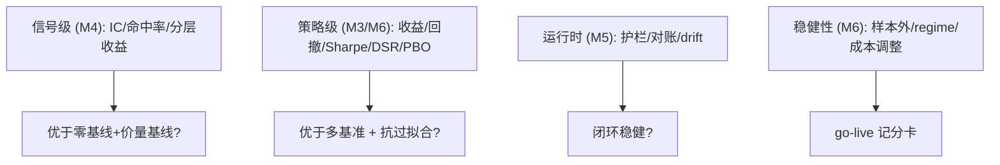

# Eval 框架技术方案（跨阶段核心）

> 前置：[README.md（共享约定）](README.md)、`docs/specs/backtest-eval.md`、`.cursor/rules/20-research-rigor.mdc`。
> 定位：Eval 是本项目的"测试套件"，是约束两层不确定性的锚点。它跨越 M3（策略评测）、M4（信号评测）、M5（运行时评测）、M6（稳健性评测），因此单独成文。

## 1. 设计目标
- **可复现**：同输入同分数。
- **抗过拟合**：结构性防止"把回测调好看"。
- **分层**：信号级、策略级、运行时、稳健性四层，逐里程碑累积。
- **自动化门禁**：接入 CI，`无评测不合并`。

## 2. Eval 分层与里程碑映射



## 3. 模块结构
```text
src/atrading/eval/
├── metrics.py       # 纯函数指标：returns/dd/sharpe/sortino/turnover
├── signal_eval.py   # IC, rank-IC, 命中率, 分层收益
├── overfit.py       # Deflated Sharpe Ratio, PBO
├── validation.py    # 切分：walk-forward, purged/embargoed CV, 最终留出
├── baselines.py     # zero, price_only, buy_hold, oss 基线接口
├── scorecard.py     # EdgeCriteria 判定 + go-live 记分卡
└── report.py        # 一键 HTML/markdown 报告
```

## 4. 指标层（纯函数、可测）
```python
# eval/metrics.py（目标接口）
def total_return(equity: pd.Series) -> float: ...
def max_drawdown(equity: pd.Series) -> float: ...
def sharpe(returns: pd.Series, rf: float = 0.0, periods: int = 252) -> float: ...
def sortino(returns: pd.Series, ...) -> float: ...
def turnover(weights: pd.DataFrame) -> float: ...
def excess_return(strategy: pd.Series, benchmark: pd.Series) -> float: ...
```
- 全部纯函数、无 IO；用已知序列做单元测试（如常数收益的 Sharpe 可手算）。

## 5. 信号评测（L1，M4）
独立于盈亏，衡量信号预测力，并强制对比基线。

```python
# eval/signal_eval.py（目标接口）
class SignalEvalResult(BaseModel):
    ic: float                 # 信号与未来收益相关性
    rank_ic: float
    hit_rate: float
    ic_t_stat: float          # 显著性
    by_quantile: dict[str, float]   # 分层收益

def evaluate_signal(signals: list[Signal], forward_returns: pd.DataFrame,
                    horizon_days: int) -> SignalEvalResult: ...
```
- **防前视**：`forward_returns` 严格取 `signal.as_of` 之后；对齐用 PIT。
- 通过判据：`ic` 达阈值且 `ic_t_stat` 显著，且优于 `price_only` 基线（见 baselines）。

## 6. 验证切分（抗过拟合核心，L2）
把"防过拟合"做成不可绕过的 API——策略评测必须走这些切分，而非在全样本上调参。

```python
# eval/validation.py（目标接口）
class Split(BaseModel):
    train: tuple[datetime, datetime]
    test: tuple[datetime, datetime]

def walk_forward(start, end, train_span, test_span, step) -> list[Split]: ...
def purged_kfold(times: pd.DatetimeIndex, k: int, embargo: float) -> list[Split]:
    """时间序列 CV，剔除训练/测试重叠信息 + embargo 缓冲，防泄漏。"""

class HoldoutGuard:
    """最终验证集守卫：一旦标记 used，禁止再次以调参目的访问（留痕）。"""
    def acquire(self, purpose: Literal["final_eval"]) -> DateRange: ...
```
- **最终留出集**由 `HoldoutGuard` 保护，访问留痕，防"偷看后调参"。

## 7. 过拟合度量（L2/L4）
```python
# eval/overfit.py（目标接口）
def deflated_sharpe_ratio(sr: float, n_trials: int, skew: float,
                          kurt: float, n_obs: int) -> float: ...
def pbo(in_sample_ranks, out_sample_ranks) -> float:  # Probability of Backtest Overfitting
    ...
```
- `n_trials`（调参/回测次数）由实验框架（M6）自动累加喂入，量化多重检验惩罚。

## 8. 基线（防"已被定价"）
```python
# eval/baselines.py（目标接口）
class Baseline(Protocol):
    def equity_curve(self, config: StrategyConfig, period) -> pd.Series: ...

# 实现：ZeroBaseline, PriceOnlyBaseline(动量/均值回归), BuyHoldBaseline,
#       OSSBaseline(封装 TradingAgents/ai-hedge-fund/FinRL 的产出，M6)
```

## 9. 记分卡与证伪判定
```python
# eval/scorecard.py（目标接口）
def build_edge_criteria(signal_res, strategy_res, baselines,
                        thresholds: CharterThresholds) -> EdgeCriteria: ...

class GoLiveScorecard(BaseModel):
    edge: EdgeCriteria
    oos_metrics_pass: bool           # 最终留出达 CHARTER 指标
    dsr_pass: bool; pbo_pass: bool
    net_of_all_costs_positive: bool
    drift_within_bounds: bool
    guardrails_verified: bool
    @property
    def go(self) -> bool: return all(...)   # 全绿才放行
```
- `CharterThresholds` 从 `PROJECT_CHARTER` 读取（单一数据源，避免阈值散落）。

## 10. 报告（一键、可复现）
```python
# eval/report.py
def render_report(result: BacktestResult, baselines, run_manifest) -> Path:
    """产出 runs/<run_id>/report.html：权益曲线 vs 多基准、回撤、
    指标表、DSR/PBO、换手/成本、与上一实验 diff。"""
```

## 11. CI Eval 门禁
- 在 CI 增加 `eval-smoke` 作业：对固定小数据集跑一遍信号/策略评测，断言指标可产出且 golden 用例通过。
- PR 若改动 `signals/`、`decision/`、`backtest/`，必须附最新 eval 报告链接（或由 CI 自动生成 artifact）。

## 12. 可复现要点
- 评测输入输出均带 `RunManifest`；切分由 `seed`/时间确定；基线与策略同引擎同成本。
- 严禁在评测代码里做隐式全样本拟合（mypy/审查 + 设计约束）。

## 13. AI-coding 任务分解
1. `feat: metrics 纯函数 + 单元测试(手算校验)`
2. `feat: validation 切分(walk-forward/purged CV) + HoldoutGuard`
3. `feat: signal_eval(IC/命中率) + 前视测试`
4. `feat: overfit(DSR/PBO)`
5. `feat: baselines(zero/price_only/buy_hold)`
6. `feat: scorecard + EdgeCriteria 判定(读 CHARTER 阈值)`
7. `feat: report 一键报告`
8. `ci: eval-smoke 门禁`

## 14. 准出映射
- 支撑 M3（策略评测框架 + 防过拟合强制）、M4（信号评测优于基线）、M6（样本外/DSR/PBO/记分卡）的所有 Exit Gate。
