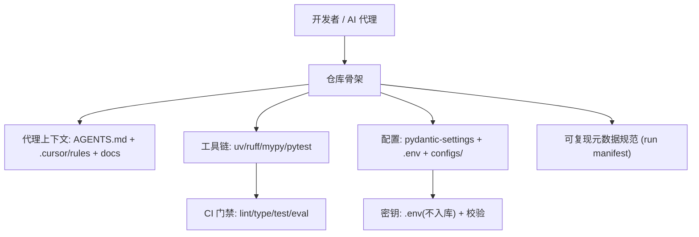

# M1 技术方案 · AI-Native 工作环境与仓库骨架

> 前置：[README.md（共享约定）](README.md)。对应里程碑：MILESTONES M1。
> 目标：把仓库打造成"AI 代理能高效、安全工作"的工程环境——稳定上下文 + 可复现 + 护栏即代码。

## 1. 范围
非交易逻辑，纯工程基建：Python 工程化、配置与密钥、CI 门禁、代理上下文与可复现元数据规范、账号规划。此阶段**不写策略/信号代码**。

## 2. 架构概览



## 3. 工程化：`pyproject.toml` 与工具链

- 用 **uv** 管理依赖与虚拟环境；`uv.lock` 入库保证可复现。
- 统一在 `pyproject.toml` 配置 ruff / mypy / pytest。

```toml
# pyproject.toml（提案，节选）
[project]
name = "atrading"
requires-python = ">=3.11"
dependencies = ["pydantic>=2", "pydantic-settings", "pandas", "pyarrow", "structlog"]

[tool.ruff]
line-length = 100
[tool.ruff.lint]
select = ["E", "F", "I", "UP", "B", "SIM"]

[tool.mypy]
strict = true
plugins = ["pydantic.mypy"]

[tool.pytest.ini_options]
addopts = "-q --strict-markers"
markers = ["golden: 已知答案回归用例", "slow: 慢测试"]
```

## 4. 配置与密钥

### 4.1 类型化配置（pydantic-settings）
所有配置集中、类型化、可从 `.env` 与 `configs/*.yaml` 加载；**运行模式与护栏开关是一等公民**。

```python
# config/settings.py（目标接口）
from pydantic import Field
from pydantic_settings import BaseSettings, SettingsConfigDict

class Settings(BaseSettings):
    model_config = SettingsConfigDict(env_file=".env", extra="ignore")

    trading_mode: Literal["paper", "live"] = "paper"   # 默认 paper（护栏）
    kill_switch: bool = False                            # true 时禁止下单

    llm_provider: str = "deepseek"
    llm_model: str = "deepseek-chat"
    llm_temperature: float = 0.0                          # 可复现默认
    llm_api_key: str | None = None

    broker_provider: str = "alpaca_paper"
    # ... 密钥字段均为 str|None，从环境注入
```

### 4.2 密钥安全（护栏即代码）
- `.env` 已被 `.gitignore` 忽略；仓库提供 `.env.example`。
- CI 增加 **secret scan**（如 gitleaks）与"启动自检"：`live` 模式必须显式设置且二次确认，否则拒绝启动。
- 任何模块只能通过 `Settings` 读取密钥，禁止散落 `os.getenv`。

## 5. 可复现元数据规范（Run Manifest）
每次回测/评测/实验运行产出一个 manifest，供后续复现与追溯（EVAL/M6 依赖）。

```python
# core/manifest.py（目标接口）
class RunManifest(BaseModel):
    run_id: str
    created_at: datetime
    git_commit: str
    data_version: str
    code_version: str
    seed: int
    llm_model: str | None = None
    prompt_version: str | None = None
    params: dict[str, object]
```

- 约定：所有可复现产物写入 `runs/<run_id>/`（已在 `.gitignore`），并附 `manifest.json`。

## 6. CI 门禁（GitHub Actions）
分层门禁，从快到慢；任一失败阻断合并。

```yaml
# .github/workflows/ci.yml（提案，节选）
jobs:
  quality:
    steps:
      - run: uv sync
      - run: uv run ruff check . && uv run ruff format --check .
      - run: uv run mypy src
      - run: uv run pytest -m "not slow"
      - run: uv run gitleaks detect   # 密钥扫描
```
- 后续里程碑会在 CI 增加"eval 门禁"作业（见 EVAL 文档）。

## 7. 代理上下文（已存在，M1 巩固）
- `AGENTS.md`、`.cursor/rules/`（00 上下文 / 10 交易安全 / 20 研究严谨 / 30 工作流）、`docs/`。
- M1 增补：在 rules 中加入"契约优先/无评测不合并"的落地提示（已在 30 号规则）。

## 8. 目录落地（M1 交付后）
```text
pyproject.toml, uv.lock, .env.example, .github/workflows/ci.yml
src/atrading/config/settings.py
src/atrading/core/manifest.py
configs/{paper.yaml}
tests/unit/test_settings.py
```

## 9. 测试策略
- `test_settings.py`：默认 `trading_mode=paper`、`kill_switch=false`；`live` 模式在缺少确认时抛错。
- manifest 序列化/反序列化可逆。

## 10. AI-coding 任务分解（建议 PR 序列）
1. `feat: pyproject + uv + ruff/mypy/pytest 骨架`
2. `feat: pydantic Settings + 运行模式/护栏字段 + 测试`
3. `feat: RunManifest + runs/ 约定`
4. `ci: GitHub Actions lint/type/test + gitleaks`
5. `docs: 账号/密钥规划清单 + .env.example 补全`

## 11. 准出映射（对应 MILESTONES M1 Exit Gate）
- 冷启动会话可复述红线 → 代理上下文完整。
- 无密钥入库 → gitleaks + `.gitignore` + Settings 强约束。
- `.cursor/rules` 生效、docs 骨架齐全 → 已具备。
- 新增：CI 门禁绿、可复现元数据规范就位。

## 12. 开放问题
- uv vs Poetry（ADR-0004）。
- 是否引入 pre-commit 本地钩子（建议是）。
- 实验追踪用文件式 vs MLflow（EVAL 文档再定）。
