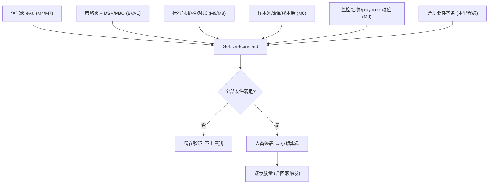
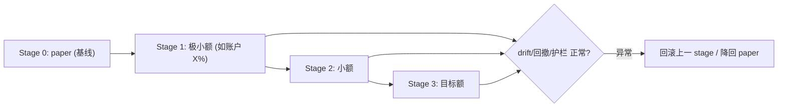

# M10 技术方案 · 合规 + 上线闸门 + 小额实盘

> 前置：[README（共享约定）](README.md)、[PROJECT_CHARTER.md](../PROJECT_CHARTER.md)、[EVAL-framework.md](EVAL-framework.md)、[M9 技术方案](M9-observability-and-ops.md)、`.cursor/rules/10-trading-safety.mdc`。对应里程碑：MILESTONES M10。
> 目标：**客观决定是否投入真实资金**，补齐合规要件，并以最小风险逐步放量。**这是唯一触碰真钱的里程碑，需人类明确签署。**

## 1. 范围与非目标

| 范围 | 非目标 |
| --- | --- |
| `GoLiveScorecard` 聚合放行判定 | 追求最大化收益/高频 |
| 合规要件（市场准入/最佳执行/审计/税务批次） | 完整券商级合规栈 |
| 小额实盘 + 逐步放量 + 回滚 | 大额/杠杆/自动放量无人值守 |

## 2. 上线闸门（Go-live Gate）

**放行条件（全部满足，逐条写入 `GoLiveScorecard`）**：

| # | 条件 | 数据源 |
| --- | --- | --- |
| 1 | 连续 N 周 paper：超额 > 基准、回撤 < 上限、无重大护栏误触发 | M8 paper + M9 监控 |
| 2 | 最终留出集样本外达 CHARTER 指标（含 DSR/PBO），成本后净收益为正 | EVAL + `HoldoutGuard` |
| 3 | live-vs-backtest drift 在阈值内；regime 刷新/退役条件已定义 | M6 `compute_drift`/`RegimeMonitor` |
| 4 | 监控/告警/incident playbook 就位 | M9 |
| 5 | 合规要件齐备（见 §3） | 本里程碑 |
| 6 | 明确初始资金上限 + 逐步放量/回滚规则；**人类签署** | 本里程碑 |

## 3. 合规要件（Compliance）

| 要件 | 说明 | 落地 |
| --- | --- | --- |
| 市场准入前风控 | SEC 15c3-5 / MiFID II Art.17 / CFTC：提交前限额校验 | 复用 `PreTradeRiskGate` + M8 引擎风控（**证据留痕**） |
| 最佳执行 | 记录执行质量（价格/滑点/时延） | M8 事件溯源 + 执行报告 |
| 审计追踪 | 每笔：触发信号 → 决策依据 → 执行结果，不可篡改 | 结构化留痕（signal/decision/fill）+ 归档 |
| 税务批次 | FIFO/批次成本记账 | 持仓/成交台账（可后置） |
| 访问控制 | 实盘操作权限 + 双人复核关键动作 | 密钥托管(M9) + 签署流程 |

## 4. 小额实盘与放量/回滚

| 机制 | 规则 |
| --- | --- |
| 放量触发 | 每 stage 满足"连续 N 期指标达标 + drift 在阈内" |
| **回滚触发** | 回撤超限 / drift 超阈 / 护栏频繁触发 / regime 退役信号 → 自动降级 stage 或回 paper |
| 资金上限 | 硬编码单笔/总仓/日亏，绝不因收益好而放宽（沿用 M5 风控） |
| kill switch | 任意时刻 `KILL_SWITCH=true` 立即停单 |

## 5. AI-coding 任务分解

1. `feat: GoLiveScorecard 聚合六条件判定 + 报告渲染`
2. `feat: 审计追踪归档(signal→decision→fill) + 最佳执行报告`
3. `feat: 放量/回滚状态机 + 触发规则 + 测试`
4. `docs: 上线闸门评审报告模板 + go/no-go ADR`
5. `chore: 实盘密钥/权限/双人复核流程接入(M9 密钥托管)`

## 5b. 与 AI-coding 工作流对齐

- **契约先行**：`GoLiveScorecard` 为聚合判定的稳定结构；放量/回滚为显式状态机。
- **测试同行**：记分卡六条件判定、放量/回滚状态机、审计追踪完整性均有单测；回滚预案需**演练**（非仅文档）。
- **eval 门禁**：记分卡直接聚合四层 eval，无绿不放行——评测是唯一裁判。
- **可复现 + 留痕**：go/no-go 决定写 ADR；每笔实盘全量审计（signal→decision→fill）。
- **安全红线**：paper→live 须 `live_confirmed` + 人类签署；LLM 绝不下单。

## 6. 准出映射（MILESTONES M10 Exit Gate）

- 记分卡六条件全绿 + 人类签署 → §2。
- 合规要件齐备 → §3。
- 回滚预案演练通过 → §4 + 演练记录。

## 7. 治理红线（不可逾越）

- 未经**明确人类批准**，不得从 paper 切到 live（`Settings.live_confirmed`）。
- LLM 仍**绝不下单**（ADR-0001）；实盘不改这条红线。
- go/no-go 决定必须写入 `docs/decisions/` 留痕。

## 7b. 实现状态（治理内核已落地）

| 模块 | 文件 | 状态 | 测试 |
| --- | --- | --- | --- |
| 上线闸门 | `governance/golive.py` `GoLiveGate` | ✅ 已实现（记分卡全绿 + 人类批准 + KILL_SWITCH 关闭，三重红线 + blockers） | `test_golive.py`（4 例） |
| 放量/回滚状态机 | `governance/ramp.py` `CapitalRampController` | ✅ 已实现（逐级晋级/软回滚/硬止损停机/人工复位） | `test_ramp.py`（7 例） |
| 防篡改审计追踪 | `governance/audit.py` `AuditTrail` | ✅ 已实现（哈希链 + `verify()` + jsonl 持久化 + signal→decision→order→fill 留痕） | `test_audit.py`（3 例） |
| go-live 记分卡聚合 | `eval/scorecard.py` `GoLiveScorecard`（复用） | ✅ 已实现（四层 eval 硬门槛收口） | `test_scorecard.py` + `test_golive.py` |
| 合规要件 / 真实签署放量 | 市场准入/最佳执行/税务批次/小额实盘 | 🔜 待真实基建（依赖 M7/M8 真实接入 + 人类闸门） | — |

> 安全红线已在代码中强制：`GoLiveGate.allowed` 要求记分卡全绿 **且** 人类明确批准 **且** KILL_SWITCH 关闭——缺省 `human_approved=False`（安全默认），绝不自动上线（ADR-0001/交易安全护栏）。全量套件 226 测试全绿。

## 8. 开放问题

- 首选实盘券商与市场（美股 Alpaca / 加密 CCXT）及各自合规口径。
- N 周/N 期与资金上限的具体数值（对齐 CHARTER 成功/失败标准）。
- 税务批次记账是否本里程碑必须，或可后置。
