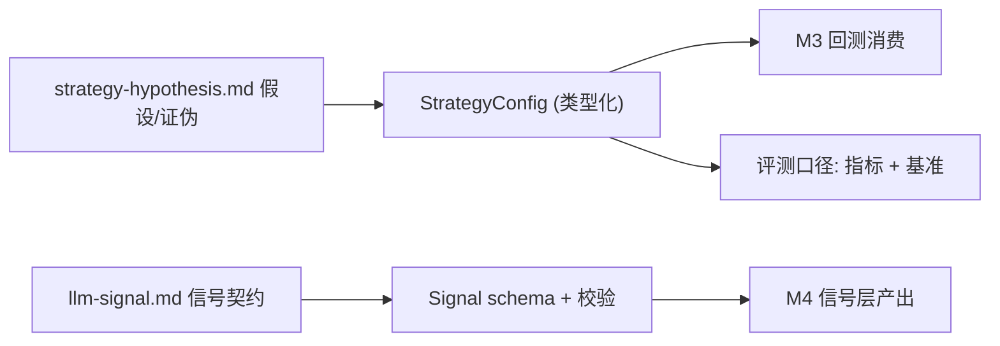

# M2 技术方案 · 策略假设与信号契约（类型化建模）

> 前置：[README.md（共享约定）](README.md)、`docs/specs/strategy-hypothesis.md`、`docs/specs/llm-signal.md`。对应里程碑：MILESTONES M2。
> 目标：把"怎么赚钱"的业务假设，落成**机器可校验的类型契约与配置**，让 M3/M4/M5 据此并行实现。

## 1. 范围
M2 仍以"规格 + 契约"为主，产出少量可执行代码：**类型契约（core/types 的落地）**、**信号 schema 校验**、**标的池/基准/评测口径的类型化配置**。不实现 LLM 调用与回测。

## 2. 从业务规格到代码契约的映射



## 3. 策略配置契约（StrategyConfig）
把标的池、决策周期、动作空间、基准、评测指标写成类型化配置（YAML + Pydantic 校验），单一数据源，供回测/执行/评测共用。

```python
# core/strategy_config.py（目标接口）
from typing import Literal
from pydantic import BaseModel, Field

class StrategyConfig(BaseModel):
    name: str
    universe: list[str] = Field(min_length=1)          # 标的池，5–15
    decision_freq: Literal["intraday", "daily", "weekly"]
    allow_short: bool = False                           # 初期 False（CHARTER）
    max_gross_exposure: float = 1.0                     # Σ|w| 上限
    max_weight_per_name: float = 0.2                    # 单标的权重上限
    benchmarks: list[str] = ["SPY", "BTC-USD", "price_only"]  # 须跑赢
    primary_metrics: list[str] = ["excess_return", "max_drawdown", "sharpe", "dsr"]
    # 与 CHARTER 成功指标对齐；阈值在 eval 侧引用 CHARTER
```

```yaml
# configs/strategies/mvp.yaml（提案）
name: mvp_hybrid
universe: [SPY, QQQ, AAPL, MSFT, NVDA, BTC-USD, ETH-USD]
decision_freq: daily
allow_short: false
max_gross_exposure: 1.0
max_weight_per_name: 0.2
benchmarks: [SPY, BTC-USD, price_only]
```

## 4. 信号契约（Signal schema 落地 llm-signal.md）
在 M2 定稳信号字段与取值域，使 M4 能"照 schema 产出"、EVAL 能"照 schema 打分"。

```python
# core/signal_schema.py（目标接口，细化自 core/types.Signal）
from enum import Enum
from pydantic import BaseModel, Field, field_validator
from datetime import datetime

class EventFlag(str, Enum):
    none = "none"; earnings = "earnings"; guidance = "guidance"
    mna = "mna"; macro = "macro"

class SignalSchemaV1(BaseModel):
    schema_version: Literal["v1"] = "v1"
    symbol: str
    as_of: datetime                          # PIT：信号当时可用时刻
    sentiment: float = Field(ge=-1, le=1)    # 归一化情绪
    event_flag: EventFlag = EventFlag.none
    horizon_days: int = Field(ge=1, le=30)   # 预期作用期
    confidence: float = Field(ge=0, le=1)
    model_version: str
    prompt_version: str
    rationale: str

    @field_validator("as_of")
    @classmethod
    def must_be_utc(cls, v: datetime) -> datetime:
        assert v.tzinfo is not None, "as_of 必须带时区(UTC)"
        return v
```

- 版本化：`schema_version` 允许演进；变更走 ADR/实验记录。
- 约束：`as_of` 强制 UTC，杜绝时区导致的 look-ahead。

## 5. 证伪条件的可执行表达
把 CHARTER/hypothesis 的证伪写成"评测断言"，供 M4/M6 直接调用（细节在 EVAL 文档）。

```python
# core/falsification.py（目标接口）
class EdgeCriteria(BaseModel):
    beats_zero_baseline: bool          # 信号优于零基线
    beats_price_only: bool             # 优于纯价量基线（防"已被定价"）
    beats_buy_hold: bool               # 优于买入持有
    beats_oss_baseline: bool           # 优于开源框架基线（M6）
    significance_ok: bool              # 达显著性判据（IC t 值/置信区间）

    @property
    def edge_confirmed(self) -> bool:
        return all([self.beats_zero_baseline, self.beats_price_only,
                    self.beats_buy_hold, self.significance_ok])
```

## 6. 测试策略
- schema 正例/反例（越界 confidence、naive datetime 应报错）。
- `StrategyConfig` 约束（权重上限、gross 上限自洽）。
- YAML ↔ 配置对象往返一致。

## 7. AI-coding 任务分解
1. `feat: core/types 落地 + 单元测试`
2. `feat: SignalSchemaV1 + 校验器 + 正反例测试`
3. `feat: StrategyConfig + YAML 加载 + 校验`
4. `feat: EdgeCriteria 骨架（供 EVAL 复用）`
5. `docs: 回填 strategy-hypothesis / llm-signal 的 TODO（标的池、指标、显著性判据）`

## 8. 准出映射（MILESTONES M2 Exit Gate）
- 证伪条件可判定 → `EdgeCriteria` + hypothesis 定稿。
- 信号 schema 足以据此写评测 → `SignalSchemaV1`。
- 标的池/基准确定 → `StrategyConfig` + mvp.yaml。
- 信号级/策略级指标 + 显著性判据入规格 → 与 EVAL 对齐。

## 9. 开放问题
- 首版信号字段集（是否加入更多因子，如新闻密度、异动标记）。
- 显著性判据具体阈值（IC 阈值 / t 统计），M2 与 EVAL 共同定。
