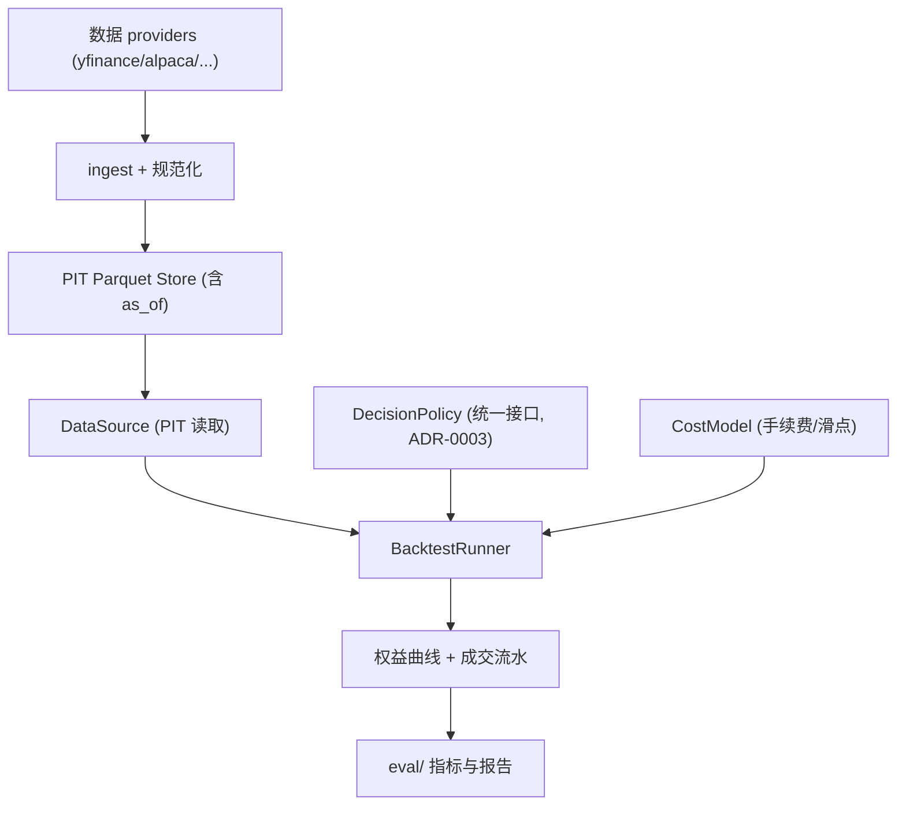

# M3 技术方案 · 数据层(PIT) + 回测引擎(复用) + 统一决策接口

> 前置：[README.md（共享约定）](README.md)、`docs/specs/backtest-eval.md`、ADR-0002/0003。对应里程碑：MILESTONES M3。
> 目标：建成全项目最关键的"测试套件"——**可复现、抗过拟合、含真实成本**的回测；并确立**回测-实盘一致**的统一决策接口。

## 1. 范围
数据获取与 PIT 存储、回测运行器（复用成熟引擎）、成本模型、统一决策接口、多基准。**过拟合防护与指标报告的细节在 [EVAL-framework.md](EVAL-framework.md)**，本文档聚焦数据与回测执行骨架。

## 2. 架构概览



## 3. 数据层（Point-in-Time）

### 3.1 Provider 适配器
统一接口，多源可回退（对标 FinRL-X 的 auto-select），带本地缓存。

```python
# data/providers/base.py（目标接口）
class BarProvider(Protocol):
    def fetch_bars(self, symbols: list[str], start: datetime, end: datetime,
                   freq: str) -> pd.DataFrame: ...   # 列: symbol,ts,ohlcv

# data/providers/yfinance_provider.py, alpaca_provider.py 各实现之
```

### 3.2 PIT 存储与读取（防 look-ahead / 幸存者偏差）
- 存储为分区 parquet：`data/bars/freq=daily/symbol=AAPL/*.parquet`。
- **每条记录带 `ingested_at`/`as_of`**；新闻与基本面尤其需要 `as_of`（发布时刻），回测只读 `as_of <= clock.now()`。
- 幸存者偏差：universe 含已退市/下架标的的历史；标的池按"当时成分"解析。

```python
# data/store.py（目标接口）
class PITStore:
    def write_bars(self, df: pd.DataFrame) -> None: ...
    def read_bars(self, symbols, start, end, freq, as_of: datetime) -> pd.DataFrame:
        """只返回 as_of<=给定时刻 的数据；用于回测的 PIT 保证。"""

# data/pit_datasource.py：用 PITStore + Clock 实现 core.DataSource
```

### 3.3 数据质量校验
- 缺口/重复时间戳/异常价（0 或负）检测；校验报告随 ingest 产出。
- 数据字典逐字段登记到 `docs/GLOSSARY.md`。

## 4. 统一决策接口（ADR-0003 的落地）
回测与实盘共用 `DecisionPolicy`（定义见共享约定）。回测通过"重放"驱动它：

```python
# backtest/runner.py（目标接口）
class BacktestRunner:
    def __init__(self, policy: DecisionPolicy, data: DataSource,
                 signals: SignalSource, costs: CostModel,
                 config: StrategyConfig, seed: int): ...

    def run(self, start: datetime, end: datetime) -> BacktestResult:
        """按 decision_freq 逐步：构造 DecisionContext(PIT) →
        policy.decide() → 目标权重 → 生成订单 → 应用成本/成交 →
        更新组合 → 记录。全程 deterministic。"""
```

- 关键：回测里 `policy.decide` 与实盘是**同一个对象**；差异只在 `DataSource`/`Broker`/`Clock` 的实现（PIT 重放 vs 实时）。
- `BacktestResult` 含权益曲线、成交流水、每步目标权重、`RunManifest`。

## 5. 回测引擎复用策略（ADR-0002=B 工作假设）
我们**不手搓撮合与净值计算**，而是把成熟引擎藏在 `BacktestRunner` 后：
- 研究速度优先：`vectorbt` / `bt` 计算权益与指标。
- 回测-实盘强一致场景：评估 `Nautilus`（同一套 actor）。
- 适配层把"目标权重/订单序列"喂给所选引擎，保证我们的 `DecisionPolicy` 语义不被引擎绑架。
- **无论用哪个引擎，PIT 与成本模型由我们控制**（很多引擎默认零成本，是常见坑）。

## 6. 成本模型（真实摩擦）
```python
# backtest/costs.py（目标接口）
class CostModel(BaseModel):
    commission_bps: float = 1.0       # 手续费
    slippage_bps: float = 5.0         # 滑点（可按流动性调整）
    min_commission: float = 0.0
    def apply(self, order: Order, ref_price: float) -> Fill: ...
```
- 参数化且有默认；成本与换手写入报告；后续可做成"按标的/流动性"的分档模型。

## 7. 多基准
- `SPY` / `BTC-USD` 买入持有 + `price_only`（纯价量/技术基线，如动量/均值回归）。
- 基准与策略走**同一回测器与成本模型**，保证可比。

## 8. 确定性与可复现
- 固定 `seed`；时间统一 UTC；`policy.decide` 纯函数。
- 每次 run 产出 `runs/<run_id>/manifest.json` + 结果 parquet。
- **已知答案合成用例**：构造价格序列使某简单策略的正确收益可手算，作为回归测试，防未来函数/计算错误。

## 9. 测试策略
- `golden/test_known_answer.py`：合成数据下回测结果 == 手算值（标 `@pytest.mark.golden`）。
- PIT 测试：请求 `as_of=T` 不返回 `as_of>T` 的行。
- 可复现测试：同 `seed`+输入两次 run，指标 diff=0。
- 成本测试：换手↑ → 成本↑，净收益单调下降。

## 10. AI-coding 任务分解
1. `feat: BarProvider 接口 + yfinance 实现 + 缓存`
2. `feat: PITStore(parquet) + read/write + 数据质量校验`
3. `feat: PITDataSource 实现 core.DataSource（PIT 保证）`
4. `feat: CostModel + 测试`
5. `feat: BacktestRunner 骨架（驱动 DecisionPolicy）`
6. `feat: 复用引擎适配层（vectorbt/bt）`
7. `feat: 基准策略（buy&hold + price_only）`
8. `test: golden 已知答案用例 + PIT + 可复现`

## 11. 准出映射（MILESTONES M3 Exit Gate）
- 可复现 diff=0、多基准可复现产出、golden 用例通过 → 本文档测试策略。
- 统一决策接口就位 → `BacktestRunner` 驱动 `DecisionPolicy`。
- 防过拟合机制强制 + DSR/PBO 字段 → 见 [EVAL-framework.md](EVAL-framework.md)（M3 与 EVAL 同步落地）。

## 12. 开放问题
- 回测引擎最终选型（vectorbt vs bt vs Nautilus），依 ADR-0002。
- 数据供应商与频率（daily 起步）。
- 新闻/基本面的 `as_of` 获取方式（供应商是否提供发布时间戳）。
