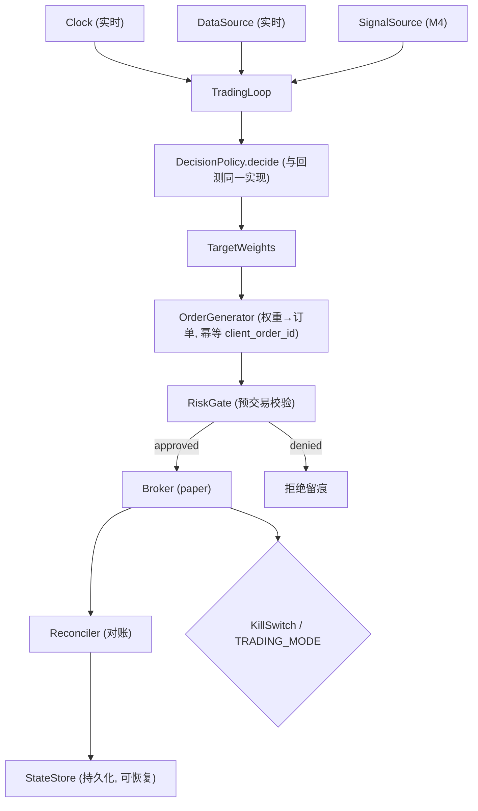

# M5 技术方案 · 决策层 + 预交易风控门 + 模拟盘执行 + 对账 + 崩溃恢复

> 前置：[README.md（共享约定）](README.md)、ADR-0003（回测-实盘一致）、`.cursor/rules/10-trading-safety.mdc`、[LANDSCAPE.md](../LANDSCAPE.md)。对应里程碑：MILESTONES M5。
> 目标：跑通 observe → 信号 → 决策 → **风控门** → 模拟盘执行 → 对账 → 记录 的完整闭环，且**复用 M3 的统一决策接口**（回测-实盘同一套决策代码）。

## 1. 范围
决策层（信号+行情→目标权重，实现 `DecisionPolicy`）、仓位管理、**预交易风控门**、模拟盘执行适配、执行对账、崩溃恢复/状态持久化、运行时留痕与 drift 记录。护栏借鉴 Nautilus RiskEngine 与 FinRL-X 三级风控。

## 2. 架构概览（事件流）



## 3. 决策层（实现统一接口 `DecisionPolicy`）
```python
# decision/policy.py（目标接口）
class RulesDecisionPolicy(DecisionPolicy):
    def __init__(self, config: StrategyConfig, sizing: PositionSizer): ...
    def decide(self, ctx: DecisionContext) -> TargetWeights:
        """纯函数：信号 + 行情 → 目标权重。无 IO、不看未来。
        回测(M3)与实盘(M5)调用同一实现（ADR-0003）。"""
```
- **纯函数**是回测-实盘一致的根基：环境差异全部隔离在 `DataSource`/`Broker`/`Clock`。

### 仓位管理
```python
# decision/sizing.py
class PositionSizer(Protocol):
    def size(self, raw_weights: dict[str, float], ctx: DecisionContext) -> dict[str, float]: ...
# 实现: VolatilityTargetSizer(波动率目标), FractionalKellySizer(分数 Kelly)
# 受 StrategyConfig.max_gross_exposure / max_weight_per_name 约束
```

## 4. 目标权重 → 订单（幂等）
```python
# execution/order_gen.py
def weights_to_orders(target: TargetWeights, portfolio: PortfolioState,
                      prices: dict[str, float]) -> list[Order]:
    """差额下单；每单生成确定性 client_order_id=hash(as_of,symbol,intent)
    → 幂等，重启/重放不重复下单。"""
```

## 5. 预交易风控门（RiskGate）— 硬护栏
所有订单**必过**，不通过即 `OrderDenied` 并留痕。借鉴 Nautilus：风控前置于执行。

```python
# risk/gate.py（目标接口）
class RiskLimits(BaseModel):
    max_position_per_name: float
    max_gross_exposure: float
    max_notional_per_order: float
    max_orders_per_interval: int          # 下单频率限额
    daily_loss_limit: float               # 每日亏损熔断阈值

class PreTradeRiskGate(RiskGate):
    def check(self, orders: list[Order], portfolio: PortfolioState) -> RiskDecision:
        # 校验: 仓位/名义/gross/下单频率/日亏熔断/kill switch/TRADING_MODE
        # 任一不过 → 加入 denied(附原因)；否则 approved
```
- **不变量（有测试覆盖）**：`execution` 层只接受来自 `RiskGate.approved` 的订单；无旁路。
- `KILL_SWITCH=true` 或 `TRADING_MODE!=paper`（未确认）→ 全部拒绝。

## 6. 模拟盘执行适配
```python
# execution/paper_broker.py：实现 core.Broker（对接 Alpaca paper / CCXT testnet）
# 统一 submit/get_positions/get_open_orders/get_fills
```
- 异常/超时 → 安全降级（默认不交易），记录并进入下一循环。

## 7. 执行对账（Reconciler）
把内部状态与券商真实状态对齐，检测漏单/重复成交/状态漂移（借鉴 Nautilus LiveExecutionEngine）。

```python
# execution/reconcile.py（目标接口）
class Reconciler:
    def reconcile(self, broker: Broker, state: StateStore) -> ReconcileReport:
        """对比内部 open_orders/positions 与 broker 实际；
        用 client_order_id 匹配 fills；对差异生成校正事件并告警。"""
```
- 启动时对账 + 周期性对账（间隔可配）；对账不一致超阈 → 告警 + 可选熔断。

## 8. 崩溃恢复 / 状态持久化（crash-only 雏形）
```python
# execution/state_store.py（目标接口）
class StateStore(Protocol):
    def save(self, state: EngineState) -> None: ...   # 原子写
    def load(self) -> EngineState | None: ...
# 实现: 文件式(JSON/SQLite) 起步；阶段7 评估 Redis
```
- 进程重启：`load()` 恢复 + 启动对账 → 幂等 `client_order_id` 保证不重复/不丢单。
- 设计为 crash-only：任何时刻被杀都能安全恢复，不依赖优雅关闭。

## 9. 运行时留痕与 drift
- 每笔交易记录：触发信号、`DecisionContext` 摘要、目标权重、订单、风控结果、成交。
- **live-vs-backtest drift**：以相同 `DecisionPolicy` 对同期回测，比较实盘与回测的权重/收益偏离，产出 drift 指标（供 M6 监控）。

## 10. 交易主循环
```python
# execution/loop.py
class TradingLoop:
    def step(self) -> None:
        # 1) 拉数据(实时 DataSource) 2) 取信号(SignalSource)
        # 3) policy.decide → target weights 4) weights_to_orders
        # 5) risk_gate.check 6) 提交 approved 7) reconcile 8) persist + log
    def run(self) -> None: ...  # 按 decision_freq 调度；捕获异常安全降级
```

## 11. 测试策略（含"注入触发"）
- 风控门：构造越限/超频订单 → 必被 denied；断言"无订单绕过风控"。
- kill switch / 非 paper 模式 → 全拒。
- 对账：注入"券商多一笔成交/少一笔"→ Reconciler 必检出并告警。
- 恢复：进程中途杀死 → 重启后状态一致、无重复下单（幂等）。
- 回测-实盘一致：同一 `DecisionPolicy` 在回测与模拟循环产出一致的目标权重（同输入）。
- Broker 全用 fake/sandbox，不接真实资金。

## 12. AI-coding 任务分解
1. `feat: RulesDecisionPolicy + PositionSizer + 纯函数测试`
2. `feat: weights_to_orders(幂等 client_order_id)`
3. `feat: PreTradeRiskGate + 限额/频率/熔断 + "无旁路"测试`
4. `feat: PaperBroker 适配(Alpaca paper) + fake broker`
5. `feat: StateStore(文件式) + 崩溃恢复测试`
6. `feat: Reconciler + 注入不一致测试`
7. `feat: TradingLoop + 安全降级 + 运行时留痕`
8. `feat: drift 记录(实盘 vs 同期回测)`

## 13. 准出映射（MILESTONES M5 Exit Gate）
- 连续运行 N 天无未捕获异常 → TradingLoop + 降级。
- 无订单绕过风控 + 每类护栏注入生效 → §5/§11。
- 对账检出注入不一致 + 重启状态恢复不重复下单 → §7/§8。
- 决策代码路径与 M3 一致 → §3 + 一致性测试。
- 100% 交易可追溯 + drift 开始产出 → §9。

## 14. 开放问题
- N（连续运行天数）取值。
- StateStore 选型（文件式 vs SQLite；阶段7 是否上 Redis）。
- 对账周期与不一致熔断阈值。
