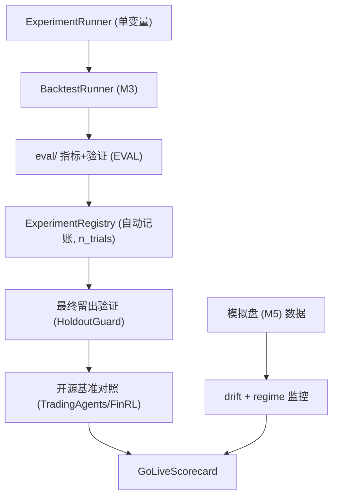

# M6 技术方案 · 实验框架 + 样本外验证 + regime/drift 监控 + 开源基准对比

> 前置：[README.md（共享约定）](README.md)、[EVAL-framework.md](EVAL-framework.md)、[LANDSCAPE.md](../LANDSCAPE.md)、`docs/experiments/`。对应里程碑：MILESTONES M6。
> 目标：用系统化实验逼近 CHARTER 成功指标，并**确认盈利是样本外可复现而非过拟合**，最终产出 go-live 记分卡。

## 1. 范围
实验编排（单变量、可复现、自动记账）、样本外/最终留出验证、开源框架对照基准、regime/模型衰减检测与刷新策略、drift 监控看板、成本调整收益。指标与切分复用 EVAL 框架。

## 2. 架构概览



## 3. 实验框架（单变量 + 自动记账）
```python
# experiments/runner.py（目标接口）
class ExperimentSpec(BaseModel):
    name: str
    hypothesis: str
    variable: str                 # 本次唯一改变量
    base_config: StrategyConfig
    overrides: dict[str, object]  # 只改一个变量
    period: DateRange
    seed: int

class ExperimentResult(BaseModel):
    manifest: RunManifest
    strategy_metrics: dict[str, float]
    baseline_metrics: dict[str, dict[str, float]]
    signal_metrics: SignalEvalResult | None
    conclusion: str | None

def run_experiment(spec: ExperimentSpec) -> ExperimentResult: ...
```
- **强制单变量**：`overrides` 只允许一个键，CI/代码校验（防"一次改一堆说不清谁有用"）。
- 结果自动写入 `docs/experiments/<date>-<name>.md`（用模板）+ `runs/<run_id>/`。

## 4. 实验记账与多重检验惩罚
```python
# experiments/registry.py
class ExperimentRegistry:
    def record(self, result: ExperimentResult) -> None: ...
    def n_trials(self, strategy: str) -> int:  # 喂给 DSR/PBO
        ...
```
- **`n_trials` 自动累加**：每跑一次实验/调参计一次，供 `deflated_sharpe_ratio` 惩罚过拟合。这是防"偷偷试很多次"的关键机制。

## 5. 样本外与最终留出验证
- 日常迭代用 walk-forward / purged CV（EVAL）。
- 结论阶段用 `HoldoutGuard` 访问**最终留出集**（从未用于调参）；访问留痕，一次性判定。
- 报告 DSR/PBO，判定是否达 CHARTER 门槛。

## 6. 开源框架对照基准（现实性校验）
```python
# eval/baselines.py::OSSBaseline（M6 实现）
# 封装 TradingAgents / ai-hedge-fund / FinRL 在同区间同标的的产出为权益曲线，
# 作为"第三类基线"。仅作对照，不作依赖；遵守混合红线（其 LLM 决策不接我们的执行）。
```
- 目的：确认我们的策略并非只是跑赢玩具基线，而是相对成熟开源方案也有优势（或至少不劣 + 更可控）。

## 7. regime / 模型衰减检测与刷新策略
```python
# monitoring/regime.py（目标接口）
class RegimeMonitor:
    def detect_shift(self, recent: pd.DataFrame, reference: pd.DataFrame) -> RegimeReport:
        """检测分布漂移（波动率/相关性/特征分布变化）。"""

class RefreshPolicy(BaseModel):
    drift_threshold: float
    min_live_days_before_refresh: int
    action_on_shift: Literal["alert", "reduce_exposure", "retire"]
```
- 定义**刷新/退役触发条件**：何时重估信号有效性、何时降杠杆、何时下线策略。对抗非平稳市场。

## 8. drift 监控看板
```python
# monitoring/drift.py + report
# 持续对比: 模拟盘(M5) 实测 vs 同期回测(同一 DecisionPolicy) 的收益/权重偏离
# 输出看板(HTML) + 超阈告警
```
- drift 大 = 要么真实摩擦被低估（改成本模型），要么代码分叉（违反 ADR-0003，须排查）。

## 9. 成本调整收益
- 在净收益中扣除：滑点/手续费（回测成本模型）+ LLM/数据成本（M4 成本记录）。
- 报告"成本前 vs 成本后"，确保结论以**成本后**为准。

## 10. go-live 记分卡
- 汇总 EVAL 的 `GoLiveScorecard`：Edge 证伪四项 + 最终留出达标 + DSR/PBO + 成本后为正 + drift 达标 + 护栏验证。
- 全绿才建议进入上线闸门评审；结果写入 `docs/decisions/`。

## 11. 测试策略
- 单变量校验：`overrides` 多于一个键应报错。
- `n_trials` 随实验次数正确累加，并影响 DSR。
- HoldoutGuard：重复以调参目的访问最终集应被拒/告警。
- drift 计算：构造"实盘=回测"应得 drift≈0；构造偏离应被检出。

## 12. AI-coding 任务分解
1. `feat: ExperimentSpec/Runner(单变量强制) + 自动写实验日志`
2. `feat: ExperimentRegistry + n_trials 累加`
3. `feat: 最终留出验证流程(HoldoutGuard 接入)`
4. `feat: OSSBaseline 封装(至少一个开源框架)`
5. `feat: RegimeMonitor + RefreshPolicy`
6. `feat: drift 监控看板 + 告警`
7. `feat: 成本调整收益报告`
8. `feat: GoLiveScorecard 汇总`

## 13. 准出映射（MILESTONES M6 Exit Gate）
- 最终留出达 CHARTER 指标 + 同时跑赢三类基线 → §5/§6/§10。
- DSR/PBO 达标（含 n_trials 惩罚）→ §4/§5。
- 成本后净收益为正 → §9。
- drift 达标 + regime 检测与刷新条件已定义 → §7/§8。
- ≥N 条实验记录构成证据链 → §3/§4。

## 14. 开放问题
- 选哪个开源框架作对照基准（TradingAgents / ai-hedge-fund / FinRL）。
- regime 检测方法（统计漂移 vs 变点检测）与阈值。
- 实验数量 N 与最终留出集时间窗。
