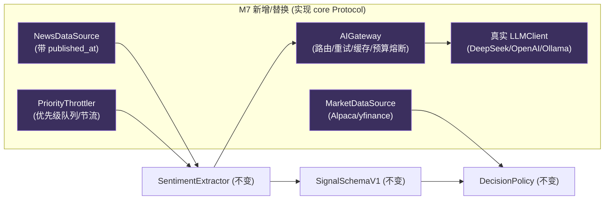

# M7 技术方案 · 真实接入 MVP（数据 + LLM + AI gateway）

> 前置：[README（共享约定）](README.md)、[PRODUCTION-READINESS.md](../PRODUCTION-READINESS.md)、[M4 技术方案](M4-llm-signal-layer.md)、`.cursor/rules/10-trading-safety.mdc`。对应里程碑：MILESTONES M7。
> 目标：把 stub 换成真实数据源与真实 LLM，让 **M4/M6 的实证类 Exit Gate 真正可判定**——真实 LLM 信号在样本外是否优于纯价量基线。**按现有 `core` Protocol 替换实现，不改调用方。**

## 1. 范围与非目标

| 范围 | 非目标 |
| --- | --- |
| 真实 `LLMClient`（便宜后端优先）+ AI gateway | 高频/实时（仍是低频日线/事件触发） |
| 真实行情 + 新闻/情绪 `DataSource`（PIT） | 真实资金（仍 paper） |
| 优先级队列 + 节流 + 成本熔断 | 复杂 RAG/向量库（先最小可用） |
| 至少一个 OSS 框架产出作对照基线 | 执行引擎升级（留给 M8） |

## 2. 架构（替换点）



> 关键：`SentimentExtractor`、`SignalCache`、`SignalLog`、`LLMSignalSource`、`DecisionPolicy` **全部不改**——M7 只在 Protocol 后换实现 + 加 gateway/节流外壳。

## 3. 真实 LLM 客户端 + AI Gateway

```python
# signals/llm_providers.py（目标接口）——均实现 core 的 LLMClient 协议
class OpenAIClient(LLMClient): ...
class DeepSeekClient(LLMClient): ...     # 成本敏感优先
class OllamaClient(LLMClient): ...       # 本地, 零 API 成本

# signals/gateway.py
class AIGateway(LLMClient):
    """在多个真实 LLMClient 前加：路由、超时/重试、结果缓存、预算熔断、降级。"""
    def __init__(self, primary: LLMClient, fallbacks: list[LLMClient],
                 budget: CostBudget, cache: SignalCache): ...
    def complete(self, *, system: str, user: str, temperature: float = 0.0) -> LLMResponse:
        # 1) 预算检查(超限→抛/降级)  2) 缓存命中直接返回
        # 3) primary 调用(超时/重试)  4) 失败→fallback 链  5) 记账
```

- **成本熔断**：`CostBudget`（日/月上限，对齐 CHARTER §8）；超限 → 停止真实调用并告警（安全降级，不下单靠 hot path 现有护栏）。
- **供应商无关**：全部实现同一 `LLMClient`，可随成本切换（DeepSeek/Ollama 优先）。
- **温度=0 + 版本固定**：可复现（沿用 M4 指纹缓存）。

## 4. 真实数据源（PIT 时序隔离——头号红线）

```python
# data/market_alpaca.py / data/market_yf.py  —— 实现 core.DataSource
# data/news_source.py  —— 新闻/财报, 每条带 published_at
class NewsDataSource:
    def documents_as_of(self, ts: datetime, symbols: list[str]) -> list[Document]:
        """只返回 published_at <= ts 的文档（PIT）。时间作过滤主键，杜绝 look-ahead。"""
```

- **防前视**：新闻/财报按 `published_at ≤ as_of` 过滤；回测必须用当时真实可得的数据。测试：构造一条"未来"新闻，断言历史决策取不到它。
- **防幸存者偏差**：universe 需含退市/下架标的。
- **数据回退 + 缓存**：多源自动回退 + 本地缓存（借鉴 FinRL-X），降本降波动。

## 5. 优先级队列与节流（LLM 经济学）

```python
# signals/throttle.py
class PriorityThrottler:
    """按异常分排序：大波动/大新闻先算；高负载/超预算时跳过小事件，
    标注 'AI paused' 而非产出过期上下文。"""
    def select(self, candidates: list[SignalRequest], budget_left: float) -> list[SignalRequest]: ...
```

- 每 tick 对全 universe 调 LLM **经济上不可行**：低频 + 事件触发 + 优先级。
- 高波动/限流期：宁可跳过并标注，也不给过期/错误上下文。

## 6. 测试策略

- **PIT 隔离**：注入未来 `published_at` 的新闻 → 历史 `documents_as_of` 必须取不到。
- **Gateway 韧性**：mock primary 超时/限流 → 走 fallback；超预算 → 熔断且安全降级。
- **缓存/幂等**：同输入不重复真实调用（沿用 M4 指纹）。
- **成本记账**：`SignalLog.total_cost` 与 gateway 记账一致。
- **真实调用最小化**：CI 用 mock/录制回放（VCR 式），**不在 CI 打真实 API**（成本 + 不确定性）。

## 7. AI-coding 任务分解

1. `feat: 真实 LLMClient 适配(DeepSeek/OpenAI/Ollama) + 契约测试(mock)`
2. `feat: AIGateway(路由/重试/缓存/预算熔断) + 韧性测试`
3. `feat: MarketDataSource(Alpaca/yfinance) 实现 core.DataSource`
4. `feat: NewsDataSource(published_at PIT) + 前视测试`
5. `feat: PriorityThrottler 节流 + 优先级`
6. `feat: OSS 框架产出封装为 oss_baseline_from_equity`
7. `exp: 真实信号样本外 vs 价量基线（写 docs/experiments/）`

## 7b. 与 AI-coding 工作流对齐

- **契约先行**：全部实现现有 `LLMClient`/`DataSource`/`SignalSource` Protocol，**不改调用方**（extractor/policy/loop 零改）。
- **测试同行**：CI 用 mock/录制回放，**不打真实 API**（成本+不确定性）；PIT 前视、gateway 韧性、成本熔断均有断言。
- **eval 门禁**：M7 产出必须过信号级 eval（IC/显著性 + 价量基线对比），无评测不合并。
- **可复现**：温度=0 + 版本固定 + 指纹缓存；实验写 `docs/experiments/`（单变量）。
- **安全红线**：真实密钥仅经 `Settings`/密钥托管，不入库；LLM 仍不下单。

## 8. 准出映射（MILESTONES M7 Exit Gate）

- 真实信号样本外优于零/价量基线 → §3/§7 + `evaluate_signal`。
- 便宜 vs 昂贵后端质量-成本结论；单位成本 ≤ 预算 → §3/§5。
- 无前视（新闻 PIT）→ §4/§6。
- Gateway 注入超时/限流 → 降级 + 成本熔断 → §3/§6。

## 8b. 实现状态（离线骨架已落地）

> 约束：本机算力有限 + 避免真实 LLM 调用。已落地**全部离线可测的结构**；真实网络/密钥路径就位但不在 CI 执行。

| 模块 | 文件 | 状态 | 测试 |
| --- | --- | --- | --- |
| 成本预算 + 熔断 | `signals/budget.py` `CostBudget` | ✅ 已实现 | `test_budget.py`（日/累计上限、次日重置、熔断） |
| AI Gateway | `signals/gateway.py` `AIGateway` | ✅ 已实现（重试/降级/缓存/预算熔断，实现 `LLMClient`） | `test_gateway.py`（降级、全失败、缓存、熔断） |
| 优先级节流 | `signals/throttle.py` `PriorityThrottler` | ✅ 已实现 | `test_throttle.py`（择优、确定性、预算约束） |
| 新闻源(PIT) | `signals/news.py` `InMemoryNewsSource` | ✅ 已实现（`published_at<=as_of`） | `test_news.py`（前视排除、symbol 过滤、确定序） |
| 真实 LLM 适配 | `signals/providers.py` `OpenAICompatibleClient` + `deepseek_client`/`ollama_client` | ⏸️ 结构就位（stdlib urllib，OpenAI 兼容），**不在 CI 调用** | 契约级（离线）；真实调用待人工开关 |
| 端到端 eval | 网关→提取器→`evaluate_signal` | ✅ 离线打通 | `test_m7_pipeline.py`（IC/命中率） |
| 真实行情源 | `data/` 已有 `yfinance` 可选适配 | ⏸️ 待接（`data` extra，网络门控） | — |

**待真人开关（避免烧钱/联网）**：`OpenAICompatibleClient.complete()` 的真实网络调用；真实信号样本外 vs 价量基线的实证实验（`docs/experiments/`）。骨架已保证真实后端一旦接入，提取器/策略/loop **零改动**即可评测。

## 9. 开放问题

- 新闻/情绪数据源选型与成本（Financial Datasets API / FMP / 自建爬取合规性）。
- 便宜后端质量是否足够（DeepSeek vs 本地 Ollama vs GPT）。
- 若 M7 证否 Edge（公开信息已被定价）：调整假设/信息源，而非硬上工程（这是有价值的负结论）。
