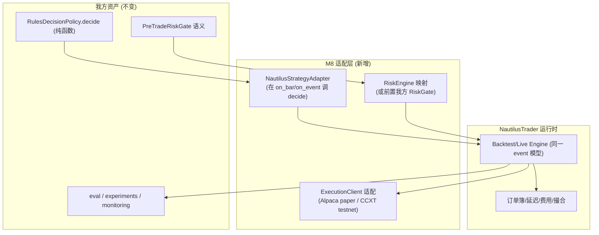
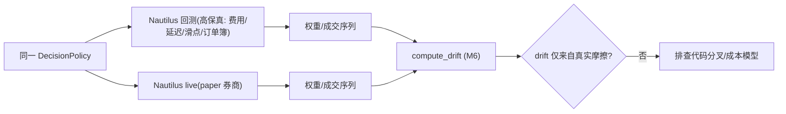

# M8 技术方案 · 生产级执行引擎（采用 NautilusTrader）+ 真实 paper 券商

> 前置：[README（共享约定）](README.md)、[PRODUCTION-READINESS.md](../PRODUCTION-READINESS.md)、[M5 技术方案](M5-decision-execution-paper.md)、[ADR-0002](../decisions/0002-leverage-oss-vs-build.md)、[ADR-0003](../decisions/0003-backtest-live-parity.md)、[ADR-0008](../decisions/0008-production-roadmap-and-oss-adoption.md)。对应里程碑：MILESTONES M8。
> 目标：把 M5 的**模拟执行雏形**升级为**生产级执行真实性**（订单簿/延迟/部分成交/高级单）+ **回测-实盘同源**，采用成熟引擎 [NautilusTrader](https://nautilustrader.io/) 而非继续手搓。

## 1. 为什么是 Nautilus（选型）

| 需求 | Nautilus 提供 | 我们现状（M5） |
| --- | --- | --- |
| 执行真实性 | 订单簿深度、延迟、部分成交、费用/撮合模型 | 即时按收盘全成交、bps 换手 |
| 回测-实盘同源 | 同一 event 模型/时钟/执行流，零改代码 | 参考引擎 + 模拟 broker（语义我们控，但非生产） |
| 预交易风控 | `RiskEngine`（提交路径前置） | 我方 `PreTradeRiskGate`（保留语义） |
| 对账/恢复 | `LiveExecutionEngine` + 事件溯源回放 | `Reconciler` + `FileStateStore`（雏形） |
| 高级单 | IOC/FOK/GTC/OCO/OTO、post-only、TWAP | 仅 market |

> 备选：Lean（多资产/公司行为强，但 C# 核较重）、freqtrade（加密专用）。见 [ADR-0008](../decisions/0008-production-roadmap-and-oss-adoption.md)。

## 2. 集成策略：适配而非重写

**原则**：我方 `core` 契约与 `RulesDecisionPolicy` 是"资产"，Nautilus 是"运行时"。在其之上做薄适配，决策代码零改。



## 3. 适配组件（目标接口）

```python
# execution/nautilus/strategy_adapter.py
class NautilusStrategyAdapter(Strategy):   # 继承 Nautilus Strategy
    """在 Nautilus 事件回调里调用我方纯函数 DecisionPolicy，产出 TargetWeights，
    经 weights_to_orders + 风控 → 提交 Nautilus 订单。决策语义与回测完全一致。"""
    def on_bar(self, bar) -> None:
        ctx = self._build_context(bar)          # 构造 DecisionContext(PIT)
        target = self._policy.decide(ctx)       # 复用 M5 同一实现
        orders = weights_to_orders(target, ...) # 复用 M5 幂等生成
        # 提交给 Nautilus（其 RiskEngine 或我方前置 RiskGate 校验）

# execution/nautilus/broker_client.py
# 将 Alpaca paper / CCXT testnet 适配为 Nautilus ExecutionClient
```

- **client_order_id 幂等**沿用 M5（跨重启不重复）。
- **风控**：优先保留我方 `PreTradeRiskGate`（前置），并对齐/补充 Nautilus `RiskEngine`；"无旁路"不变量继续有测试。

## 4. 真实 paper 券商

| 券商 | 市场 | 用途 |
| --- | --- | --- |
| Alpaca paper | 美股/ETF/加密 | 主 paper 环境 |
| CCXT testnet（Binance 等） | 加密 | 加密 paper |

- 处理**部分成交 / 拒单 / 断线重连 / 限流**（M5 未覆盖）。
- 密钥仅经 `Settings`/密钥托管（M9），不落盘不入库。

## 5. 回测-实盘一致（升级版）



- 用 Nautilus 的高保真回测替代 M3 的 bps 换手近似，drift 分析更可信。
- 事件溯源回放用于审计/复现/调试。

## 6. 测试策略

- **Parity**：同一 `DecisionPolicy` 在 Nautilus 回测 vs paper live 目标权重一致（同输入）。
- **执行边界**：注入部分成交/拒单/重连 → 状态一致、无重复/丢单（幂等）。
- **无旁路**：越限订单被风控拒绝，不达券商（沿用 M5 不变量）。
- **对账**：注入券商侧多/少成交 → 检出并告警。
- 全程 fake/sandbox，**不接真实资金**。

## 7. AI-coding 任务分解

1. `chore: 引入 nautilus_trader 依赖 + 最小 backtest 跑通`
2. `feat: NautilusStrategyAdapter 承载 RulesDecisionPolicy(决策零改) + parity 测试`
3. `feat: ExecutionClient 适配 Alpaca paper + 部分成交/拒单/重连处理`
4. `feat: RiskEngine 映射 / 前置我方 RiskGate + 无旁路测试`
5. `feat: 高保真回测(费用/延迟/滑点) 替代 bps 近似`
6. `feat: 事件溯源回放 + 对账注入测试`
7. `exp: Nautilus 回测 vs paper drift 实测（写 docs/experiments/）`

## 7b. 与 AI-coding 工作流对齐

- **契约先行**：Nautilus 藏在 `core.Broker`/`Clock`/`DataSource` 适配层后；`RulesDecisionPolicy` 决策代码零改。
- **测试同行**：parity、执行边界（部分成交/拒单/重连）、无旁路、对账注入全程 fake/sandbox，**不接真实资金**。
- **eval 门禁**：真实成本/滑点下的策略级 eval + live-vs-backtest drift 实测才可推进。
- **可复现**：事件溯源回放支撑审计与调试；同输入→同权重（parity 断言）。
- **安全红线**：沿用 M5"无订单绕过风控"不变量；密钥经密钥托管（M9）。

## 8. 准出映射（MILESTONES M8 Exit Gate）

- 回测-实盘 parity（drift 仅真实摩擦）→ §5/§6。
- paper 连续 ≥ N 天无未捕获异常；重连/部分成交/拒单有处理与测试 → §4/§6。
- 无订单绕过风控；对账检出注入不一致 → §3/§6。

## 8b. 实现状态（离线执行真实性已落地；Nautilus 为后续真实基建）

> 约束：本机算力有限，暂不引入 `nautilus_trader`（Rust 重依赖）。先落地**同协议、可离线测试的执行真实性**（§9 折中项已先行），把 Nautilus 采用留作真实基建阶段。

| 模块 | 文件 | 状态 | 测试 |
| --- | --- | --- | --- |
| 成本模型（费用/滑点/冲击） | `execution/costs.py` `CommissionModel`/`SlippageModel` | ✅ 已实现（纯函数，回测/实盘共用） | `test_costs.py`（每股/bps/下限；方向；参与率冲击） |
| 高保真 broker | `execution/realistic_broker.py` `RealisticBroker`（实现 `core.Broker`） | ✅ 已实现（延迟 + 部分成交 + 费用 + 滑点 + 幂等） | `test_realistic_broker.py`（7 例） |
| 回测-实盘 parity | 无摩擦下 `RealisticBroker == SimulatedBroker` | ✅ 已实现 | `test_execution_parity.py`（同源 + 摩擦致有界 drift） |
| Nautilus 采用 | `NautilusStrategyAdapter` / `ExecutionClient` | ⏸️ 待真实基建（重依赖 + 联网 paper） | 契约就位（`core.Broker` 可互换） |
| 真实 paper 券商 | Alpaca paper / CCXT testnet 适配 | ⏸️ 待真实基建（联网 + 人工开关） | — |

**要点**：`RealisticBroker` 与 `SimulatedBroker` 实现同一 `core.Broker` 协议且可互换——无摩擦配置下持仓/现金/权益完全一致（parity），显式配置费用/滑点/延迟后 drift 有界且完全归因于真实摩擦（ADR-0003）。这满足 M8"执行真实性"的离线可测目标；Nautilus/真实 paper 为后续真实基建，届时按同协议替换、决策代码零改。

## 9. 开放问题

- Nautilus 许可（GPLv3 vs 商业）对本项目分发/使用的影响。
- 我方 `PreTradeRiskGate` 与 Nautilus `RiskEngine` 是"二选一"还是"双层"。
- 连续运行天数 N 与 paper 环境稳定性口径。
- 若 Nautilus 集成成本过高，是否退回"M5 引擎 + 真实 paper 券商适配"的折中。
