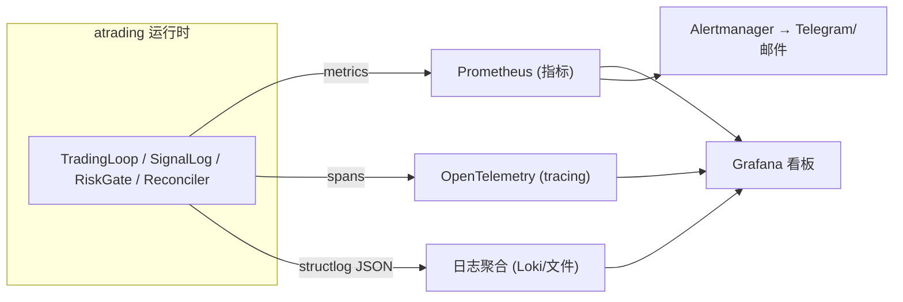
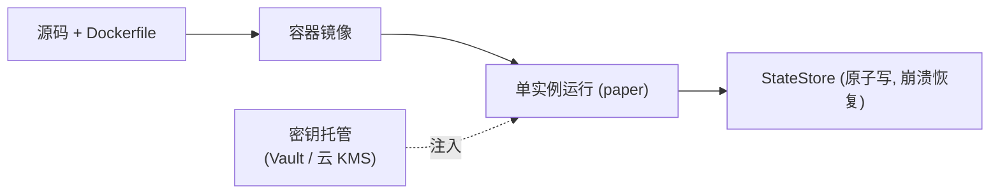

# M9 技术方案 · 可观测性与运维就绪

> 前置：[README（共享约定）](README.md)、[PRODUCTION-READINESS.md](../PRODUCTION-READINESS.md)、[M5 技术方案](M5-decision-execution-paper.md)、[ADR-0008](../decisions/0008-production-roadmap-and-oss-adoption.md)。对应里程碑：MILESTONES M9。
> 目标：让系统"**看得见、跑得住、可运维**"——碰真钱前的硬前置。**可与 M8 并行。**

## 1. 范围与非目标

| 范围 | 非目标 |
| --- | --- |
| 指标(Prometheus) + 看板(Grafana) + tracing(OTel) | 大规模分布式/K8s 集群（低频单实例足够） |
| 告警（护栏/对账/drift/成本） | 复杂 APM 商业方案 |
| 容器化(Docker) + 密钥托管 | 自动扩缩容 |
| Incident playbook + 优雅停机/恢复演练 | 多区域高可用 |

## 2. 三支柱可观测性（Observability）



| 支柱 | 采集什么 | 关键实现 |
| --- | --- | --- |
| **Metrics** | 决策延迟、LLM 延迟/成本/token、护栏触发计数、对账不一致数、drift 值、成交/拒单数 | `monitoring/metrics.py`（Prometheus client） |
| **Tracing** | 每个决策周期 + **每次 LLM/工具调用**独立 span（[Why AI Agents Fail 2026]） | OTel 装饰 `SentimentExtractor` / `AIGateway` / `TradingLoop.step` |
| **Logs** | 结构化事件（已有 structlog）+ trace_id 关联 | 复用现有 `StepReport`/`SignalLog`，注入 trace_id |

## 3. 指标埋点（离线优先实现）

**决策（对齐"本机算力有限/离线优先"）**：先实现**零依赖**的 `MetricsRegistry`，直接输出 **Prometheus 文本 exposition 格式**（可被真实 Prometheus 直接 scrape）；`prometheus_client` / OpenTelemetry 作为**可选升级**（optional-dependency group `obs`），不作为核心依赖。埋点接口保持稳定，升级只换后端。

```python
# monitoring/metrics.py（已实现，零依赖）
class MetricsRegistry:
    def inc(self, name: str, value: float = 1.0, **labels: str) -> None: ...      # Counter
    def set(self, name: str, value: float, **labels: str) -> None: ...            # Gauge
    def observe(self, name: str, value: float, **labels: str) -> None: ...        # Histogram
    def render(self) -> str: ...   # Prometheus 文本格式（# TYPE/# HELP + 样本）

# 约定指标名（atrading_ 前缀）
#   atrading_decision_seconds        Histogram  决策周期耗时
#   atrading_steps_total             Counter    循环步数 {result=ok|degraded}
#   atrading_orders_submitted_total  Counter    提交订单数
#   atrading_risk_denials_total      Counter    风控拒单 {reason=...}
#   atrading_reconcile_mismatch      Gauge      对账不一致数
#   atrading_llm_cost_usd_total      Counter    LLM 累计成本 {model=...}
#   atrading_llm_tokens_total        Counter    token 数 {kind=input|output}
#   atrading_signal_cache_total      Counter    缓存 {result=hit|miss}
#   atrading_suspicious_docs_total   Counter    可疑文档（注入嫌疑）
```

> 埋点**不改决策逻辑**——只在 `execution`/`signals` 边界包一层，保持 `DecisionPolicy` 纯函数。`MetricsRegistry` 作为可选参数注入（默认 `None` = 无埋点），不破坏既有构造函数与测试。

## 4. 告警规则（碰真钱前必须能响）

| 告警 | 触发条件 | 严重度 | 处置入口 |
| --- | --- | --- | --- |
| 护栏误触发 | `RISK_DENIALS` 异常升高 / kill_switch 被触发 | P1 | playbook §护栏 |
| 对账不一致 | `RECONCILE_MISMATCH > 0` | P1 | playbook §对账 |
| drift 超阈 | `DRIFT_VALUE > 阈值`（regime 衰减） | P2 | playbook §drift |
| LLM 成本超预算 | `LLM_COST_TOTAL` 超日/月上限 | P2 | 熔断 + playbook §成本 |
| feed/券商断连 | 心跳超时 | P1 | 安全降级 + playbook §断连 |

## 5. 部署与密钥托管



| 项 | 方案 | 替换的现状 |
| --- | --- | --- |
| 打包 | Dockerfile + compose（app + Prometheus + Grafana） | 无 |
| 密钥 | Vault / 云 KMS 运行时注入，**不落盘不入库** | 明文 `.env` |
| 部署 | 一键脚本 / CI 产出镜像 | 仅质量门禁 CI |
| 停机 | 优雅停机（收尾持久化）+ 启动对账 | 已有崩溃恢复雏形 |

## 6. Incident Playbook（`docs/runbooks/`）

- **feed 异常**：安全降级（本步不交易）→ 切备源 → 恢复后启动对账。
- **券商断连**：停止提交 → 重连退避 → 对账补齐 → 恢复。
- **成本失控**：AI gateway 熔断 → 降级到便宜/本地模型或暂停信号（标注 AI paused）。
- **护栏误触发**：kill_switch 现状确认 → 复核限额 → 人工放行。
- **崩溃恢复**：`load()` → 启动对账 → 校验持仓/现金/未平仓 → 继续。

## 7. AI-coding 任务分解

1. `feat: monitoring/metrics.py + Prometheus 端点`
2. `feat: OTel tracing 装饰 LLM/决策/执行 span`
3. `feat: Grafana 面板 JSON + compose(app+prom+grafana)`
4. `feat: Alertmanager 规则 + 通道(Telegram/邮件)`
5. `feat: Dockerfile + 密钥托管接入(替代明文 .env)`
6. `docs: runbooks/ incident playbook + 停机/恢复演练脚本`

## 8. 测试策略（离线，无网络）

| 测试 | 断言 |
| --- | --- |
| Registry 语义 | `inc/set/observe` 正确累加/覆盖/入桶；标签区分序列 |
| 文本格式 | `render()` 产出合法 Prometheus exposition（`# TYPE`/`# HELP` + 样本行），可被解析 |
| TradingLoop 集成 | 正常步 → `steps_total{result=ok}` +1、降级步 → `{result=degraded}` +1、拒单 → `risk_denials_total` 计数 |
| 信号层集成 | 提取一次 → `llm_cost_usd_total`/`tokens_total` 累加；缓存命中 → `signal_cache_total{result=hit}` |
| 无埋点回退 | `metrics=None` 时行为与之前完全一致（不破坏既有测试） |

## 9. 与 AI-coding 工作流对齐

- **契约先行**：`MetricsRegistry` 为稳定接口，后端（零依赖/prometheus_client/OTel）可替换。
- **测试同行**：每个指标有断言（见 §8）；埋点默认关闭（`metrics=None`），新增指标/告警/tracing 测试后套件 192 全绿。
- **小 PR**：按 §7 逐条提交（Conventional Commits）。
- **可复现**：指标为纯累加/覆盖，确定性可断言。

## 10. 准出映射（MILESTONES M9 Exit Gate）

- 每类关键异常可触发告警（注入验证）→ §4 + 注入测试。
- 一键容器化部署可复现；密钥不落盘不入库 → §5。
- 崩溃/断连演练自动恢复、无重复/丢单 → §6 + 幂等测试。

## 10b. 实现状态（离线优先，已落地）

| 模块 | 文件 | 状态 | 测试 |
| --- | --- | --- | --- |
| 度量注册表 | `monitoring/metrics.py` `MetricsRegistry`（+ `counter_total`） | ✅ 已实现（Prometheus 文本 + `/metrics`） | `test_monitoring_metrics.py` |
| 循环/信号埋点 | `execution/loop.py`、`signals/extractor.py` | ✅ 已实现（延迟/步数/拒单/对账/成本/token/缓存/可疑文档） | `test_trading_loop.py`、`test_extractor.py` |
| 告警规则 | `monitoring/alerts.py` `AlertRule`/`evaluate_alerts`/`default_rules` | ✅ 已实现（对账/降级/可疑文档/成本，阈值化可注入验证） | `test_alerts.py`（5 例） |
| 轻量 tracing | `monitoring/tracing.py` `Tracer`/`Span`/`SpanRecord` | ✅ 已实现（父子链接 + 耗时，可注入时钟/ID） | `test_tracing.py`（3 例） |
| 容器化 + runbook | `Dockerfile`、`docs/runbooks/incident-playbook.md` | ✅ 已实现 | — |
| 真实看板/告警通道/OTLP/密钥托管 | Grafana/Alertmanager/OTel/KMS | 🔜 待真实基建（依赖 M7/M8） | — |

> M9 离线核心已完整：**指标 + 埋点 + 阈值告警 + tracing + 容器化 + runbook**，全量套件 175 测试全绿。真实看板/告警通道/OTLP 导出/密钥托管留待真实基建阶段。

## 9. 开放问题

- 自建 Prometheus/Grafana vs 托管（Grafana Cloud）成本权衡。
- 单实例是否够（低频下够）；何时才需要消息总线（见 [PRODUCTION-READINESS G5](../PRODUCTION-READINESS.md)）。
- 告警阈值标定需真实运行数据（与 M7/M8 联动）。
